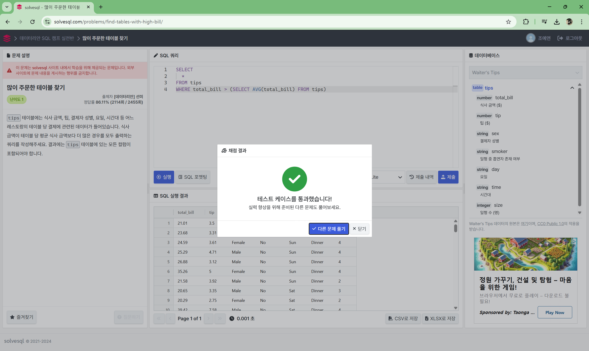
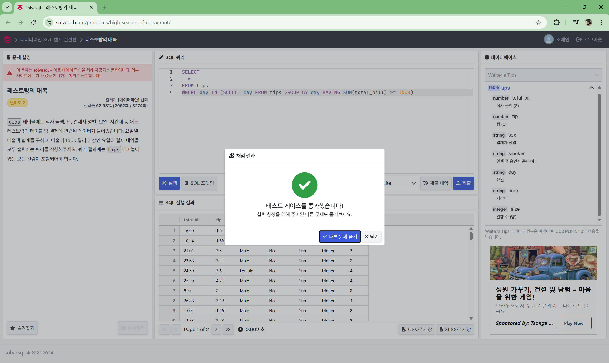
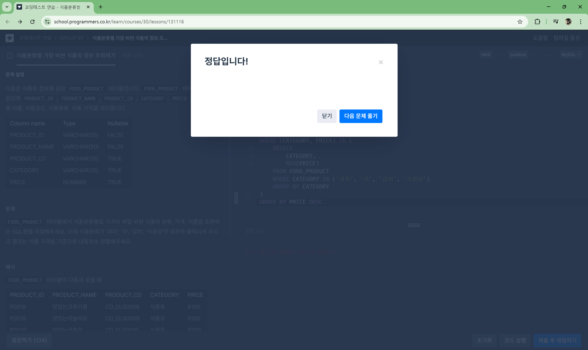

# **📌 Week 0: 서브쿼리 & CTE(공통 테이블 표현식)**

## **주요 개념**

- **서브쿼리**: `EXISTS`, `NOT EXISTS`, `IN`, `ANY`, `ALL`
- **CTE (공통 테이블 표현식)**: `WITH`
    - 🚨 **`WITH RECURSIVE`는 4주차에 다룰 예정이므로, 이번 주차에서는 `WITH` 중심으로 학습**해 주세요.
    - 해당 문법의 개념과 사용 시 주의할 점들을 정리하여 깃허브에 정리해 주세요.

---

## **✅ 서브쿼리 학습 및 문제 풀이**[🔗](https://dev.mysql.com/doc/refman/8.0/en/subqueries.html)

### 📖 15.2.15. Subqueries
**서브쿼리의 주요 장점**
- 복잡한 JOIN이나 UNION 없이도 원하는 데이터를 쉽게 추출할 수 있다.
- 쿼리를 구조적으로 나누어 이해하기 쉽게 만든다.
- 많은 경우 복잡한 JOIN보다 가독성이 높다.

**서브쿼리의 주요 형태**
- 스칼라 서브쿼리: 단일 값 반환
- 컬럼 서브쿼리: 단일 열 반환
- 행 서브쿼리: 단일 행 반환
- 테이블 서브쿼리: 여러 행과 여러 열 반환

### 📖 15.2.15.2. Comparisons Using Subqueries

```sql
non_subquery_operand comparison_operator (subquery)
# comparison_operator : =, >, <, >=, <=, <>, !=, <=>
```

**서브쿼리가 필요한 경우(JOIN으로 해결할 수 없는 경우)**
1. 최대값과 비교
2. 특정 값이 두 번 등장하는 행 찾기

**서브쿼리 비교 조건**
- 스칼라 서브쿼리 비교: 서브쿼리의 결과가 단일 값(스칼라)이어야 한다.
- 행 서브쿼리 비교: 서브쿼리가 여러 값을 반환할 경우, 비교 대상이 동일한 개수의 값이어야 한다.

### 📖 15.2.15.3. Subqueries with ANY, IN or SOME

```sql
operand comparison_operator ANY (subquery)
operand IN (subquery)
operand comparison_operator SOME (subquery)
# comparison_operator : =, >, <, >=, <=, <>, !=
```

#### ANY 연산자
ANY는 서브쿼리에서 반환된 값 중 하나라도 비교 조건을 만족하면 TRUE를 반환한다.

```sql
SELECT s1 FROM t1 WHERE s1 > ANY (SELECT s1 FROM t2);
```

#### IN 연산자
IN은 = ANY와 동일하게 동작한다.
단, IN은 리스트에서 사용할 수 있지만 = ANY는 리스트에서 사용할 수 없다.

```sql
SELECT s1 FROM t1 WHERE s1 = ANY (SELECT s1 FROM t2);
SELECT s1 FROM t1 WHERE s1 IN    (SELECT s1 FROM t2);
```

#### SOME 연산자
SOME은 ANY와 완전히 동일한 의미를 가진다.

```sql
SELECT s1 FROM t1 WHERE s1 <> ANY  (SELECT s1 FROM t2);
SELECT s1 FROM t1 WHERE s1 <> SOME (SELECT s1 FROM t2);
```
SQL 문법에서 a <> ANY (b)는 **"b 중 일부와 다르면 TRUE"**를 의미하며,
일반적인 영어 문장에서는 "a가 b 중 어느 것과도 같지 않다"로 이해될 수 있기 때문에,
SOME을 사용하면 의미가 더 명확해질 수 있다.

### 📖 15.2.15.4. Subqueries with ALL

```sql
operand comparison_operator ALL (subquery)
```
ALL은 서브쿼리에서 반환된 모든 값에 대해 비교 연산자가 참이면 TRUE를 반환한다.

#### <> ALL과 NOT IN의 관계
```sql
SELECT s1 FROM t1 WHERE s1 <> ALL (SELECT s1 FROM t2);
SELECT s1 FROM t1 WHERE s1 NOT IN (SELECT s1 FROM t2);
```

#### MySQL 8.0.19 이후 TABLE 사용 가능
단일 컬럼 테이블이 있고, 서브쿼리가 특정 컬럼 값에 의존하지 않는다면 TABLE을 사용할 수 있다.

```sql
SELECT s1 FROM t1 WHERE s1 <> ALL (TABLE t2);
SELECT s1 FROM t1 WHERE s1 NOT IN (TABLE t2);
```

### 📖 15.2.15.6. Subqueries with EXISTS or NOT EXISTS
#### 기본 개념
- EXISTS (subquery): 서브쿼리가 하나 이상의 행을 반환하면 TRUE
- NOT EXISTS (subquery): 서브쿼리가 아무 행도 반환하지 않으면 TRUE
- 서브쿼리의 SELECT 목록은 무시되므로 SELECT *, SELECT 5, SELECT column1 등을 사용해도 동일한 결과

### 📖 15.2.15.10. Subquery Errors
#### 1. 지원되지 않는 서브쿼리 문법
```sql
SELECT * FROM t1 WHERE s1 IN (SELECT s2 FROM t2 ORDER BY s1 LIMIT 1);
```
- 해결 방법: LIMIT을 제거하거나, JOIN을 사용하여 우회

#### 2. 서브쿼리의 컬럼 개수 오류
```sql
SELECT (SELECT column1, column2 FROM t2) FROM t1;
```
- 해결 방법: 
  - 여러 컬럼을 반환해야 한다면 행 비교(row comparison) 문법을 사용
  - 한 개의 컬럼만 반환하도록 쿼리를 수정


#### 3. 서브쿼리의 행 개수 오류
```sql
SELECT * FROM t1 WHERE column1 = (SELECT column1 FROM t2);
```
- *해결 방법: ANY 또는 IN을 사용하여 다중 행을 비교
  ```sql
  SELECT * FROM t1 WHERE column1 = ANY (SELECT column1 FROM t2);
  ```


#### 4. 업데이트 시 테이블 사용 오류
```sql
UPDATE t1 SET column2 = (SELECT MAX(column1) FROM t1);
```
- 해결 방법: WITH 또는 파생 테이블(derived table) 을 사용하여 우회
  ```sql
  UPDATE t1 
  SET column2 = (SELECT MAX_VAL FROM (SELECT MAX(column1) AS MAX_VAL FROM t1) AS subquery);
  ```
---
### 📝 Solvesql - 많이 주문한 테이블[🔗](https://solvesql.com/problems/find-tables-with-high-bill/)
```sql
SELECT
  *
FROM tips
WHERE total_bill > (SELECT AVG(total_bill) FROM tips)
```


### 📝 Solvesql - 레스토랑의 대목[🔗](https://solvesql.com/problems/high-season-of-restaurant/)

## **✅ CTE (`WITH`) 학습 및 문제 풀이**[🔗](https://dev.mysql.com/doc/refman/8.0/en/with.html) 
```sql
SELECT
  *
FROM tips
WHERE day IN (SELECT day FROM tips GROUP BY day HAVING SUM(total_bill) >= 1500)
```


### 📖 15.2.20 WITH (Common Table Expressions)
#### 공통 테이블 표현식(CTE) 개요
- CTE(Common Table Expression)는 임시 결과 집합으로, 하나의 SQL 문 내에서만 존재하고 여러 번 참조 가능한 명명된 서브쿼리임.
- WITH 절을 사용하여 정의하며, 쿼리의 가독성과 재사용성을 높이는 데 유용함.
```sql
WITH cte_name AS (subquery)
SELECT * FROM cte_name;
```
#### 재귀 CTE(Recursive CTE)
- 자기 자신을 참조하는 CTE

#### CTE 사용 시 제약 사항
1. 동일 쿼리 블록 내에서 WITH 중복 사용 불가
2. 같은 WITH 절 내에서 CTE 이름 중복 정의 불가
3. CTE는 앞서 정의된 CTE만 참조 가능
4. CTE는 자신이 속한 쿼리 블록보다 내부 블록의 CTE를 참조할 수 없음

### 📝 programmers - 식품분류별 가장 비싼 식품의 정보 조회하기[🔗](https://school.programmers.co.kr/learn/courses/30/lessons/131116) 

```sql
-- 서브쿼리
SELECT
    CATEGORY,
    PRICE AS MAX_PRICE,
    PRODUCT_NAME
FROM FOOD_PRODUCT
WHERE (CATEGORY, PRICE) IN (
    SELECT
        CATEGORY,
        MAX(PRICE)
    FROM FOOD_PRODUCT
    WHERE CATEGORY IN ('과자', '국', '김치', '식용유')
    GROUP BY CATEGORY
)
ORDER BY PRICE DESC
```

