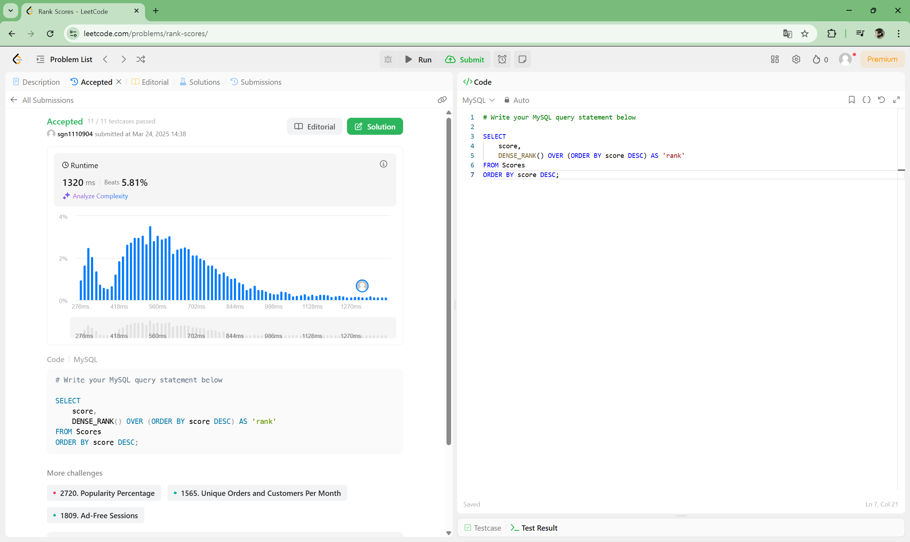
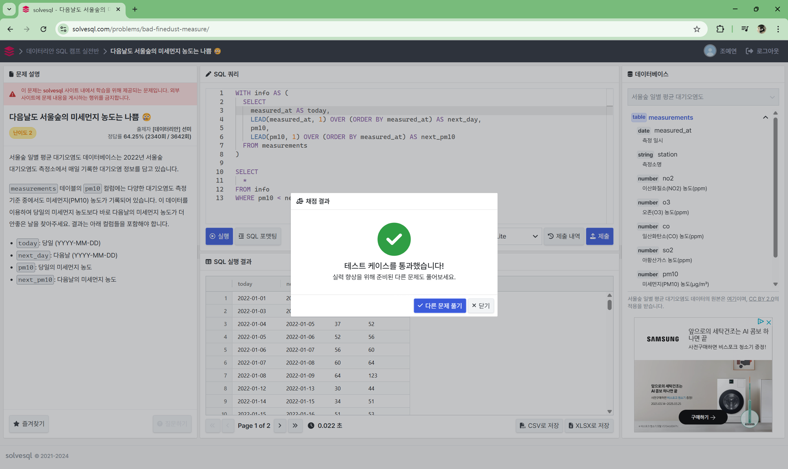
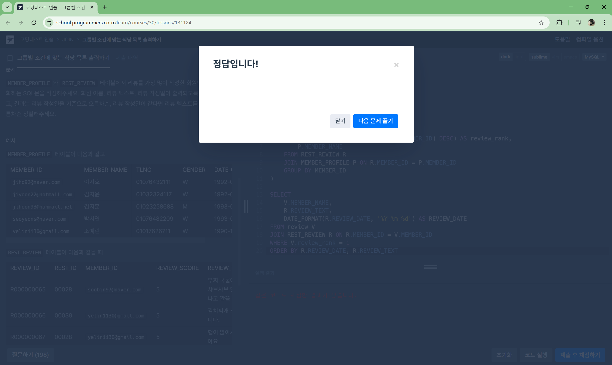

# **📌 Week 1: 윈도우 함수 (Window Functions)**

## **주요 개념**

- **윈도우 함수 (Window Functions)**:
    - `ROW_NUMBER()`, `RANK()`, `DENSE_RANK()`
    - `LAG()`, `LEAD()`
    - `SUM() OVER()`, `AVG() OVER()`
    - `PARTITION BY`, `ORDER BY` 등
- 해당 문법의 개념과 사용 시 주의할 점들을 정리하여 깃허브에 정리해 주세요.

---

## **✅ 윈도우 함수 (Window Functions) 학습 및 문제 풀이**


### 📖 14.20.2. Window Function Concepts and Syntax[🔗](https://dev.mysql.com/doc/refman/8.0/en/window-functions-usage.html)

**윈도우 함수 개요**
- 윈도우 함수는 집계 함수처럼 동작하지만, 각 행에 대해 결과를 반환하는 것이 차이점
- 일반적인 SUM() 같은 집계 함수는 그룹을 하나의 결과 행으로 축소하는 반면, 윈도우 함수는 각 행별로 연산 결과를 제공

**윈도우 함수의 문법**
- OVER 절 기본 문법
```sql
OVER ( [PARTITION BY column] [ORDER BY column] [frame_clause] )
```
- PARTITION BY → 특정 기준으로 그룹을 나눔 (예: 국가별)
- ORDER BY → 그룹 내에서 정렬을 수행
- frame_clause → 프레임 범위를 지정 (예: 현재 행을 기준으로 앞/뒤 범위 설정)

**사용 가능한 윈도우 함수 목록**
- 집계 함수 (Aggregate Functions)
    - AVG(), COUNT(), MAX(), MIN(), SUM()
    - STDDEV(), VARIANCE(), BIT_AND(), BIT_OR(), BIT_XOR()

- 순위 함수 및 기타 함수
    - ROW_NUMBER(), RANK(), DENSE_RANK(), PERCENT_RANK()
    - NTILE(), LEAD(), LAG(), FIRST_VALUE(), LAST_VALUE(), NTH_VALUE()

### 📖 14.20.1. Window Function Descriptions[🔗](https://dev.mysql.com/doc/refman/8.0/en/window-function-descriptions.html)

**윈도우 함수 목록**
| 함수명         | 설명                                      | 추가 설명 |
|--------------|-----------------------------------------|---------|
| CUME_DIST()  | 누적 분포 값 계산                        |현재 행보다 작거나 같은 값의 비율을 반환하는 누적 분포 함수, 공식: 현재 행보다 작거나 같은 행 수 ÷ 전체 행 수 , 반환 값: 0 ~ 1
| DENSE_RANK() | 중간 순위 없이 현재 행의 순위 반환        |순위를 부여하지만, 동일한 값에는 같은 순위를 할당하고 중간 순위를 건너뛰지 않음, ORDER BY 없이 사용하면 모든 행이 동등한 순위를 가짐
| FIRST_VALUE()| 윈도우 프레임의 첫 번째 행 값 반환       |
| LAG()        | 현재 행보다 N행 앞의 값 반환             |현재 행보다 N행 앞의 값을 반환, N번째 이전 값이 없으면 default 값 반환 (기본값: NULL)
| LAST_VALUE() | 윈도우 프레임의 마지막 행 값 반환       |
| LEAD()       | 현재 행보다 N행 뒤의 값 반환             |
| NTH_VALUE()  | 윈도우 프레임에서 N번째 행 값 반환       |
| NTILE()      | 파티션을 N개의 그룹으로 나누고 그룹 번호 반환 |
| PERCENT_RANK() | 백분위 순위 값 반환                     |
| RANK()       | 중간 순위 포함, 현재 행의 순위 반환       |
| ROW_NUMBER() | 파티션 내에서 행 번호 반환               |

### 📖 14.20.4. Named Windows[🔗](https://dev.mysql.com/doc/refman/8.0/en/window-functions-named-windows.html)

1. WINDOW 절을 활용한 코드 간소화
- WINDOW 절을 사용하면 중복되는 OVER 절을 제거하여 쿼리를 간결하게 만들 수 있음

2. OVER 절에서 명명된 윈도우 수정
- OVER window_name 형식으로 명명된 윈도우를 참조할 수 있으며, 추가 속성을 적용할 수도 있음음

3. 명명된 윈도우의 제한 사항
- 명명된 윈도우는 OVER 절에서 속성을 추가할 수는 있지만 기존 속성을 수정할 수 없음음

4. 명명된 윈도우의 참조 규칙
- 명명된 윈도우는 다른 명명된 윈도우를 참조할 수 있으며, 순환 참조(Cycle) 가 없는 경우에만 가능
- 순환 참조가 발생하면 MySQL에서 오류가 발생

### 📖 14.19.1. Aggregate Function Descriptions[🔗](https://dev.mysql.com/doc/refman/8.0/en/aggregate-functions.html)

| 윈도우 함수              | 설명                   |
|------------------------|----------------------|
| AVG(expr) OVER(...)   | 행별로 평균값을 계산  |
| COUNT(expr) OVER(...) | 행별 개수를 계산      |
| MAX(expr) OVER(...)   | 행별 최댓값을 계산    |
| MIN(expr) OVER(...)   | 행별 최솟값을 계산    |
| SUM(expr) OVER(...)   | 행별 합계를 계산      |
| BIT_AND(expr) OVER(...) | 비트 AND 연산 수행  |
| BIT_OR(expr) OVER(...)  | 비트 OR 연산 수행   |
| BIT_XOR(expr) OVER(...) | 비트 XOR 연산 수행  |

- OVER() 절을 사용하면 집계 함수가 윈도우 함수처럼 동작함.
- PARTITION BY를 추가하면 특정 그룹별 연산 가능.
- ORDER BY를 추가하면 누적 합계 같은 순차적 연산 가능.

---
### 📝 LeetCode - Rank Scores[🔗](https://leetcode.com/problems/rank-scores/description/) `DENSE_RANK()`

```sql
# Write your MySQL query statement below

SELECT
    score,
    DENSE_RANK() OVER (ORDER BY score DESC) AS 'rank'
FROM Scores
ORDER BY score DESC;
```


### 📝 Solvesql - 다음날도 서울숲의 미세먼지 농도는 나쁨 😢[🔗](https://solvesql.com/problems/bad-finedust-measure/) `LEAD()`

```sql
WITH info AS (
  SELECT
    measured_at AS today,
    LEAD(measured_at, 1) OVER (ORDER BY measured_at) AS next_day,
    pm10,
    LEAD(pm10, 1) OVER (ORDER BY measured_at) AS next_pm10
  FROM measurements
)

SELECT
  *
FROM info
WHERE pm10 < next_pm10
```


### 📝 programmers - 그룹별 조건에 맞는 식당 목록 출력하기[🔗](https://school.programmers.co.kr/learn/courses/30/lessons/131124)

```sql
-- 코드를 입력하세요
WITH review AS (
    SELECT
        R.MEMBER_ID,
        COUNT(R.MEMBER_ID) AS COUNT_ID,
        RANK() OVER (ORDER BY COUNT(R.MEMBER_ID) DESC) AS review_rank,
        P.MEMBER_NAME
    FROM REST_REVIEW R
    JOIN MEMBER_PROFILE P ON R.MEMBER_ID = P.MEMBER_ID
    GROUP BY MEMBER_ID
)

SELECT
    V.MEMBER_NAME,
    R.REVIEW_TEXT,
    DATE_FORMAT(R.REVIEW_DATE, '%Y-%m-%d') AS REVIEW_DATE
FROM review V
JOIN REST_REVIEW R ON R.MEMBER_ID = V.MEMBER_ID
WHERE V.review_rank = 1
ORDER BY R.REVIEW_DATE, R.REVIEW_TEXT
```

