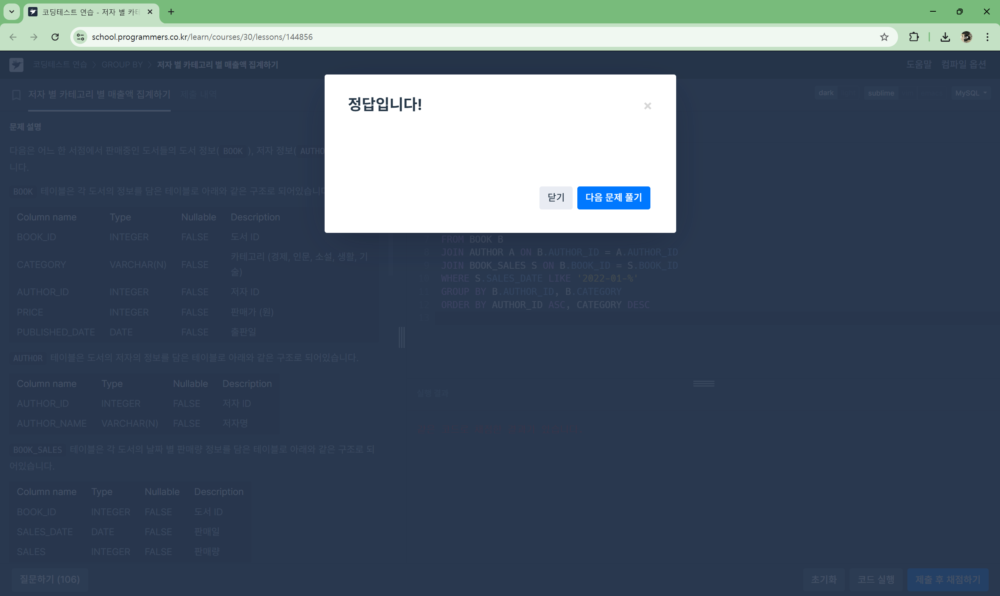
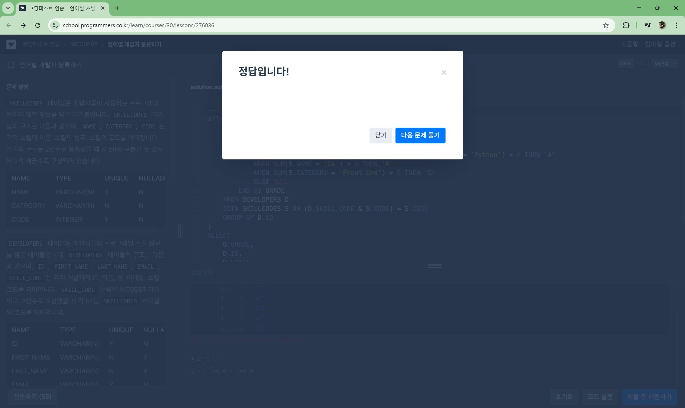

# **📌 Week 2: 복합 JOIN & GROUP BY + HAVING**

## **주요 개념**

- **복합 JOIN & GROUP BY + HAVING**:
    - `INNER JOIN`, `LEFT JOIN`, `RIGHT JOIN`, `FULL OUTER JOIN`
    - `CROSS JOIN`, `SELF JOIN`
    - `GROUP BY`, `HAVING`
- 해당 문법의 개념과 사용 시 주의할 점들을 정리하여 깃허브에 정리해 주세요.

---

## **✅ 복합 JOIN 학습 및 문제 풀이**

### 📖 MySQL 공식 문서 - 조인[🔗](https://dev.mysql.com/doc/refman/8.0/en/join.html)

**기본 JOIN 문법 구조**
```sql
FROM table1 [JOIN 유형] table2 [ON 조건 또는 USING]
```

**지원되는 JOIN 유형**
- INNER JOIN, JOIN, CROSS JOIN → 내부 조인
- LEFT [OUTER] JOIN → 왼쪽 외부 조인
- RIGHT [OUTER] JOIN → 오른쪽 외부 조인
- NATURAL JOIN → 공통 컬럼 자동 조인
- STRAIGHT_JOIN → 왼쪽 테이블을 무조건 먼저 읽는 조인
- { OJ ... } → ODBC 호환용 문법

**JOIN 키워드 별 특징**
|JOIN 유형 |	설명 |
|----------|----------|
|INNER JOIN	| 양쪽 테이블에 모두 존재하는 행만 반환 |
|LEFT JOIN	| 왼쪽 테이블은 모두 포함, 오른쪽은 매칭 없으면 NULL |
|RIGHT JOIN	| 오른쪽 테이블은 모두 포함, 왼쪽은 매칭 없으면 NULL |
|CROSS JOIN / ,	| 데카르트 곱 (모든 조합) |
|NATURAL JOIN |	양쪽 테이블의 공통 컬럼 기준으로 자동 JOIN |
|USING (col)	| 공통 컬럼을 하나로 합쳐 JOIN |
|ON	JOIN | 조건을 명시적으로 작성 |

**USING, NATURAL JOIN 시 주의사항**
- USING (col)은 해당 컬럼이 양쪽 테이블에 모두 있어야 함
- NATURAL JOIN은 공통 컬럼 모두를 자동으로 기준 삼아 조인
- 중복 컬럼은 하나의 컬럼(COALESCE)으로 합쳐짐

**기타 정보**
- ON 절에서는 반드시 해당 JOIN에 참여하는 테이블의 컬럼만 참조 가능
- JOIN은 ,(콤마)보다 우선순위가 높음 → 조인을 섞어 쓸 경우 괄호로 명확하게 그룹화 필요
- JOIN에 사용할 수 있는 테이블 수는 최대 61개
- PARTITION 절을 이용해 특정 파티션만 대상으로 조인 가능
- Index Hint (USE, FORCE, IGNORE) 를 통해 옵티마이저에게 인덱스 사용 지시 가능
- STRAIGHT_JOIN은 순서대로 조인해야 할 때 사용

---
### 📝 programmers - 저자별 카테고리 별 매출액 집계하기[🔗](https://school.programmers.co.kr/learn/courses/30/lessons/144856)

```sql
-- 코드를 입력하세요
SELECT
    B.AUTHOR_ID,
    A.AUTHOR_NAME,
    B.CATEGORY,
    SUM(S.SALES*B.PRICE) AS TOTAL_SALES
FROM BOOK B
JOIN AUTHOR A ON B.AUTHOR_ID = A.AUTHOR_ID
JOIN BOOK_SALES S ON B.BOOK_ID = S.BOOK_ID
WHERE S.SALES_DATE LIKE '2022-01-%'
GROUP BY B.AUTHOR_ID, B.CATEGORY
ORDER BY AUTHOR_ID ASC, CATEGORY DESC
```


## **✅ GROUP BY + HAVING 학습 및 문제 풀이**

### 📖 MySQL 공식 문서 - GROUP BY[🔗](https://dev.mysql.com/doc/refman/8.0/en/group-by-handling.html)

**비결정적 SELECT에 대한 처리**
- GROUP BY에 포함되지 않은 컬럼은 서버가 임의로 선택하게 되며, ORDER BY는 결과 정렬만 할 뿐, 그룹 내 어떤 값이 선택되는지에 영향 없음

```sql
-- name은 GROUP BY에 포함되지 않았지만 선택 가능
SELECT name, MAX(age) FROM t GROUP BY id;
-- 이 때 어떤 name이 선택될지는 예측할 수 없음
```

**ANY_VALUE() 함수로 명시적으로 표현 가능**
- 어떤 값을 가져오든 상관없을 때는 ANY_VALUE(column) 사용 가능
```sql
SELECT name, ANY_VALUE(address), MAX(age)
FROM t
GROUP BY name;
```

**HAVING 절에서의 별칭(Alias) 사용**
- MySQL에서는 집계 함수에 별칭을 지정하고 이를 HAVING에서 참조 가능

```sql
-- 표준 SQL 방식
SELECT name, COUNT(name)
FROM orders
GROUP BY name
HAVING COUNT(name) = 1;

-- MySQL 확장 문법 (별칭 사용)
SELECT name, COUNT(name) AS c
FROM orders
GROUP BY name
HAVING c = 1;
```

**GROUP BY에서의 표현식(Expression) 지원**
- 표준 SQL: GROUP BY에는 컬럼만 허용
- MySQL: 수식(예: FLOOR(value/100))도 허용 또는 별칭을 이용한 표현도 가능

**표현식 기반 GROUP BY에서의 컬럼 인식**
- GROUP BY에 있는 표현식이 SELECT에도 동일하게 등장하면, MySQL은 이를 같은 것으로 간주
- 그러나, 비슷한 수식이라도 직접적으로 GROUP BY에 없다면 오류 발생 가능
```sql
-- 오류 가능
SELECT id, FLOOR(value/100), id + FLOOR(value/100)
FROM tbl_name
GROUP BY id, FLOOR(value/100);

-- 해결 방법: 파생 테이블(서브쿼리)로 처리
SELECT id, F, id + F
FROM (
  SELECT id, FLOOR(value/100) AS F
  FROM tbl_name
  GROUP BY id, FLOOR(value/100)
) AS dt;
```

### 📖 MySQL 공식 문서 - HAVING[🔗](https://dev.mysql.com/doc/refman/8.0/en/select.html)

**HAVING 절이란?**
- GROUP BY 절로 생성된 그룹에 조건을 지정할 때 사용
- WHERE는 개별 행(row) 에 조건
- HAVING은 그룹(group) 에 조건

**WHERE vs. HAVING**
| 구분 | WHERE | HAVING |
|---|------|-------|
| 적용 시점	| 그룹화 이전 |	그룹화 이후 |
| 대상 | 각 행 | 각 그룹 |
| 집계 함수 사용 | 사용 불가 | 사용 가능 |

**HAVING 절의 특징**
- GROUP BY 절이 없을 경우, 전체가 하나의 그룹으로 간주됨
- HAVING에서 집계 함수와 컬럼 별칭(alias) 을 사용할 수 있음

**주의할 점**
1. WHERE 절 대신 HAVING 사용 금지
2. 모호한 컬럼명 사용 시 경고 발생
3. GROUP BY와 HAVING 모두에서 사용되는 컬럼명이 있을 때 → GROUP BY의 컬럼으로 우선 인식됨
4. 중복된 컬럼 이름은 피하는 것이 좋음음

### 📝 programmers - 언어별 개발자 분류하기[🔗](https://school.programmers.co.kr/learn/courses/30/lessons/276036)

```SQL
-- 코드를 작성해주세요
WITH GRADES AS (
    SELECT
        D.ID AS ID,
        CASE
            WHEN SUM(S.CATEGORY = 'Front End') > 0 AND SUM(S.NAME = 'Python') > 0 THEN 'A'
            WHEN SUM(S.NAME = 'C#') > 0 THEN 'B'
            WHEN SUM(S.CATEGORY = 'Front End') > 0 THEN 'C'
            ELSE NULL
        END AS GRADE
    FROM DEVELOPERS D
    JOIN SKILLCODES S ON (D.SKILL_CODE & S.CODE) = S.CODE
    GROUP BY D.ID
)
SELECT
    G.GRADE,
    D.ID,
    D.EMAIL
FROM DEVELOPERS D
JOIN GRADES G ON G.ID = D.ID
HAVING G.GRADE IS NOT NULL
ORDER BY G.GRADE ASC, D.ID ASC;
```

