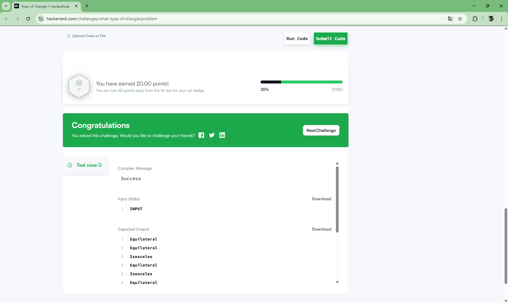
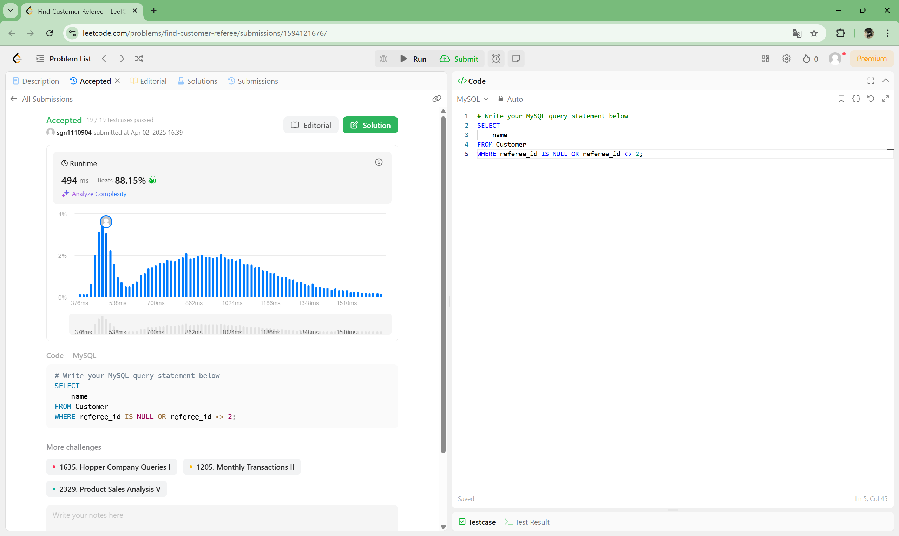

# **📌 Week 3: CASE문 & 비교, 논리 연산자 활용**

## **주요 개념**

- **CASE문 & 논리 연산자 활용**:
    - `CASE WHEN`
    - `IF()`, `IFNULL()`, `NULLIF()`
    - `COALESCE()`
- 해당 문법의 개념과 사용 시 주의할 점들을 정리하여 깃허브에 정리해 주세요.

---

## **✅ CASE문 & 논리 연산자 학습 및 문제 풀이**

### 📖 MySQL 공식 문서 - 흐름제어함수[🔗](https://dev.mysql.com/doc/refman/8.4/en/flow-control-functions.html)

**주요 함수 요약**
| 함수 | 설명 |
|---|------|
| CASE	| 조건에 따라 다른 값을 반환 |
| IF()	| 조건이 참이면 A, 거짓이면 B 반환 |
| IFNULL()	| 첫 번째 인자가 NULL이면 두 번째 인자를 반환 |
| NULLIF()	| 두 인자가 같으면 NULL, 다르면 첫 번째 인자를 반환 |

**CASE 문법**
1) `CASE value WHEN ... THEN ... ELSE ... END`
    ```sql
    SELECT CASE 1 
        WHEN 1 THEN 'one' 
        WHEN 2 THEN 'two' 
        ELSE 'more' 
    END;
    -- 결과: 'one'
    ```
2) `CASE WHEN condition THEN ... ELSE ... END`
    ```sql
    SELECT CASE WHEN 1 > 0 THEN 'true' ELSE 'false' END;
    -- 결과: 'true'
    ```
- ELSE가 없고 어떤 조건도 만족하지 않으면 NULL 반환
- 반환 타입은 각 THEN, ELSE 값의 종합 타입(aggregated type)에 따라 결정됨
(숫자 → 숫자, 문자열 → 문자열 등)

**IF(expr1, expr2, expr3)**
- expr1이 참(<> 0 & NOT NULL)이면 expr2, 아니면 expr3 반환
```sql
SELECT IF(1 < 2, 'yes', 'no');  -- 결과: 'yes'
```
- 반환 타입은 expr2, expr3의 타입에 따라 결정됨 (예: 둘 중 하나가 문자열이면 문자열 반환)

**IFNULL(expr1, expr2)**
- expr1이 NULL이 아니면 expr1 반환
- NULL이면 expr2 반환
```sql
SELECT IFNULL(NULL, 'default');  -- 결과: 'default'
SELECT IFNULL(5, 'default');     -- 결과: 5
```
- 반환 타입은 더 일반적인 타입(문자열 > 실수 > 정수)

**NULLIF(expr1, expr2)**
- expr1 = expr2이면 NULL 반환
- 다르면 expr1 반환
```sql
SELECT NULLIF(1, 1);  -- 결과: NULL
SELECT NULLIF(1, 2);  -- 결과: 1
```
- CASE WHEN expr1 = expr2 THEN NULL ELSE expr1 END와 동일한 기능
- 두 인자가 다르면 expr1을 두 번 평가함에 주의

**기타 유의사항**
- 문자 집합(COLLATION) 문제로 문자열 비교 시 오류가 날 수 있음 → CAST()로 문자 집합 명시 필요
- CASE, IF(), IFNULL() 등은 저장된 값, 표현식, 시스템 변수에 모두 사용 가능

### 📖 MySQL 공식 문서 - 비교, 논리연산자 [🔗](https://dev.mysql.com/doc/refman/8.4/en/comparison-operators.html)

**기본 비교 연산자**
| 연산자                        | 설명                      | 예시                                   |
|-----------------------------|---------------------------|----------------------------------------|
| =                           | 같음                      | 'a' = 'a' → 1                          |
| <=>                         | NULL 안전 비교 (둘 다 NULL이면 1) | NULL <=> NULL → 1             |
| !=, <>                      | 같지 않음                 | 'a' <> 'b' → 1                         |
| <, >, <=, >=                | 대소 비교                 | 3 < 5 → 1                              |
| BETWEEN A AND B             | 범위 내 포함              | 3 BETWEEN 1 AND 5 → 1                  |
| NOT BETWEEN A AND B         | 범위 밖                   | 6 NOT BETWEEN 1 AND 5 → 1              |
| IN (a, b, c)                | 목록 안에 포함            | 'x' IN ('x', 'y') → 1                  |
| NOT IN (a, b, c)            | 목록에 없음               | 'z' NOT IN ('x', 'y') → 1              |
| IS NULL                     | NULL 여부 확인            | NULL IS NULL → 1                       |
| IS NOT NULL                 | NULL 아님 확인            | 1 IS NOT NULL → 1                      |
| IS TRUE / FALSE / UNKNOWN  | 논리값 확인               | 1 IS TRUE → 1                          |
| IS NOT TRUE / FALSE / UNKNOWN | 논리값 부정            | NULL IS NOT UNKNOWN → 0               |

**주요 비교 함수**
| 함수                        | 설명                                 | 예시                                      |
|---------------------------|--------------------------------------|-------------------------------------------|
| COALESCE(val1, val2, ...) | 첫 번째 NULL이 아닌 값을 반환        | COALESCE(NULL, 3) → 3                     |
| GREATEST(val1, ...)       | 가장 큰 값을 반환                     | GREATEST(2, 8, 5) → 8                     |
| LEAST(val1, ...)          | 가장 작은 값을 반환                   | LEAST('A', 'B') → 'A'                     |
| EXISTS(subquery)          | 서브쿼리 결과 존재 여부               | 결과 있으면 1, 없으면 0                  |
| NOT EXISTS(subquery)      | 서브쿼리 결과 없을 때 1               |                                           |
| INTERVAL(N, N1, N2, ...)  | 값이 어느 구간에 속하는지 인덱스 반환 | INTERVAL(10, 1, 5, 10, 20) → 3           |
| ISNULL(expr)              | 값이 NULL인지 여부 확인 (NULL이면 1) | ISNULL(NULL) → 1                          |

**비교 시 주의사항**
- =으로 NULL 비교 불가능 → <=> 또는 IS NULL 사용
- 문자열 vs 숫자 비교 시 암묵적 형변환 발생 → 예측 어려울 수 있음
- IN() 리스트에 서로 다른 타입 섞지 말 것 (비교 규칙이 달라짐)
- GREATEST()나 LEAST()는 NULL 포함 시 결과도 NULL

### 📝 HackerRank - 삼각형 종류 분류하기[🔗](https://www.hackerrank.com/challenges/what-type-of-triangle/problem) `CASE문`
```sql
/*
Enter your query here.
*/
SELECT
    CASE 
        WHEN A + B > C AND B + C > A AND C + A > B THEN
            CASE
                WHEN A = B AND B = C THEN 'Equilateral'
                WHEN A = B OR B = C OR C = A THEN 'Isosceles'
                ELSE 'Scalene'
            END
        ELSE 'Not A Triangle'
    END AS TRIANGLE_TYPE
FROM TRIANGLES;
```



### 📝 LeetCode - find-customer-referee[🔗](https://leetcode.com/problems/find-customer-referee/description/) `IS NULL`

```sql
# Write your MySQL query statement below
SELECT
    name
FROM Customer
WHERE referee_id IS NULL OR referee_id <> 2;
```

