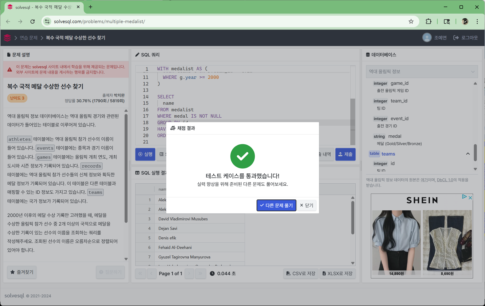
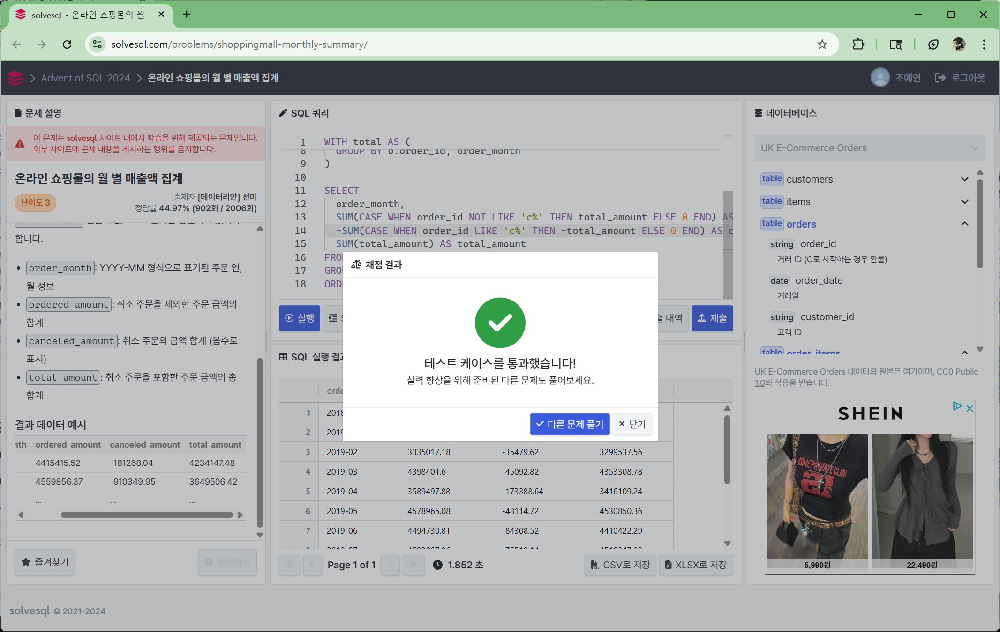
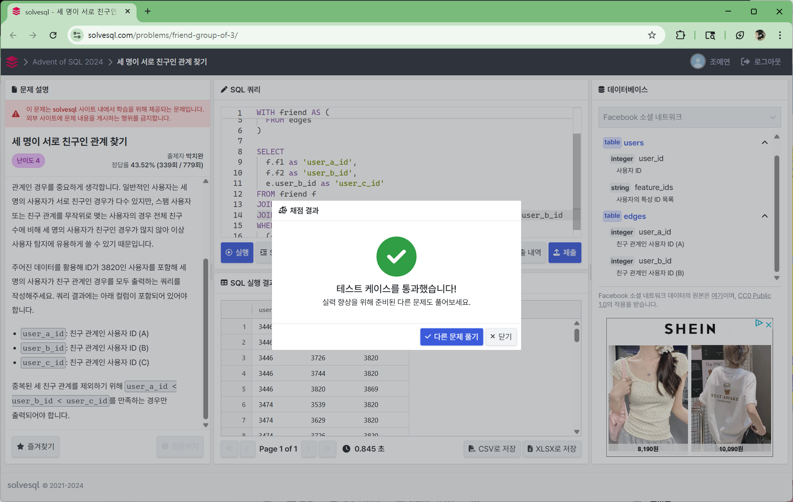

## **📌 Week 6: 종합 실전 문제 풀이**

### **과제 안내**

 지금까지 학습한 SQL 개념들을 **종합적으로 활용**하여 문제를 해결해보세요!

 0~5주차 과제에서는 주차별로 명확한 학습 주제를 제시하고, 해당 개념을 적용하는 방식으로 쿼리 작성 연습을 진행하였다면, 이번 6주차 과제에서는 별도의 주제나 개념을 제시하지 않고, 오직 문제만을 바탕으로 쿼리를 설계하고 작성해야 합니다.

 이번 과제에서는 문제를 이해하고 필요한 지표와 분석 방향을 스스로 판단하여 쿼리를 구성하는 사고력을 기르는 것을 목표로 합니다.

 아래의 항목을 사전에 정리한 뒤 쿼리를 작성하면 문제 해결에 필요한 흐름을 구조화하는 데 도움이 될 수 있습니다.

```jsx
**[쿼리 작성 템플릿]**
- 쿼리를 작성하는 목표, 확인할 지표:
- 쿼리 계산 방법:
- 데이터의 기간:
- 사용할 테이블:
- Join KEY:
- 데이터 특징:
```

## **✅문제 풀이**: 

### 📝 solvesql - 복수 국적 메달 수상한 선수 찾기[🔗](https://solvesql.com/problems/multiple-medalist/)
```sql
```

### 📝 solvesql - 온라인 쇼핑몰의 월 별 매출액 집계[🔗](https://solvesql.com/problems/shoppingmall-monthly-summary/)
```sql
```

### 📝 solvesql - 세 명이 서로 친구인 관계 찾기[🔗](https://solvesql.com/problems/friend-group-of-3/)
```sql
```
