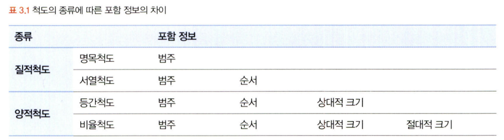
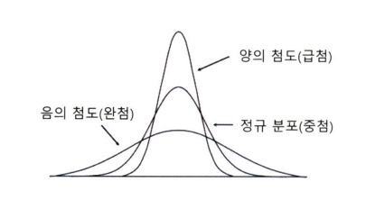

# 통계학 1주차 정규과제

📌통계학 정규과제는 매주 정해진 분량의 『*데이터 분석가가 반드시 알아야 할 모든 것*』 을 읽고 학습하는 것입니다. 이번 주는 아래의 **Statistics_1st_TIL**에 나열된 분량을 읽고 `학습 목표`에 맞게 공부하시면 됩니다.

아래의 문제를 풀어보며 학습 내용을 점검하세요. 문제를 해결하는 과정에서 개념을 스스로 정리하고, 필요한 경우 추가자료와 교재를 다시 참고하여 보완하는 것이 좋습니다.

1주차는 `1부. 데이터 기초체력 기르기`를 읽고 새롭게 배운 내용을 정리해주시면 됩니다.


## Statistics_1st_TIL

### 1부. 데이터 기초체력 기르기
### 01. 통계학 이해하기
### 02. 모집단과 표본추출
### 03. 변수와 척도
### 04. 데이터의 기술 통계적 측정
### 05. 확률과 확률변수

## Study Schedule

|주차 | 공부 범위     | 완료 여부 |
|----|----------------|----------|
|1주차| 1부 p.2~56     | ✅      |
|2주차| 1부 p.57~79    | 🍽️      | 
|3주차| 2부 p.82~120   | 🍽️      | 
|4주차| 2부 p.121~202  | 🍽️      | 
|5주차| 2부 p.203~254  | 🍽️      | 
|6주차| 3부 p.300~356  | 🍽️      | 
|7주차| 3부 p.357~615  | 🍽️      | 

<!-- 여기까진 그대로 둬 주세요-->

# 01. 통계학 이해하기

```
✅ 학습 목표 :
* 통계학의 필요성에 대해 인식한다.
* 기술통계와 추론통계의 특성을 구분할 수 있다.
```
<!-- 새롭게 배운 내용을 자유롭게 정리해주세요.-->
> 통계학의 필요성
- 데이터 과학은 기초 통계로부터 발전해 왔으며, 그 의미를 해석함에 있어서도 통계 이론에 기반해야 한다.

> 기술 통계
- 문자 그대로 주어진 데이터의 특성을 사실에 근거하여 설명하고 묘사하는 것

> 추론 통계
- 표본 집단으로부터 모집단의 특성을 추론하는 것
- 한 통계치를 통해 전체의 통계치를 추정하는 것


# 02. 모집단과 표본추출

```
✅ 학습 목표 :
* 모집단과 표본의 정의와 관계를 설명할 수 있다.
* 편향과 분산의 차이를 설명할 수 있다.
```

<!-- 새롭게 배운 내용을 자유롭게 정리해주세요.-->
> 모집단(population)
- 분석 대상 전체의 집단

> 표본(sample)
- 모집단의 부분집합, 모집단의 일부를 추출한 것

> 전수조사
- 모집단의 자료 전체를 조사 및 분석하여 정보를 추출하는 것

> 표본조사
- 모집단에서 추출한 표본을 통해 모집단의 정보(평균, 표준편차 등)를 추정하고 검정하는 것

> 표본 오차(sampling error)
- 모집단과 표본의 자연 발생적인 변동

> 비표본 오차(non-sampling error)
- 표본 오차를 제외한 변동
- 대표적인 원인 : 편향(bias)

> 편향
- 표본에서 나타나는 모집단과의 체계적인 차이
- 표본추출편향(sample selection bias)
    - 표본 추출 과정에서 체계적인 경향이 개입되어 모집단에서 편향된 표본만 추출되는 경우
- 가구편향(household bias)
    - 모집단의 부분 집단 단위에서 하나의 관측치씩 추출하는 경우 크고 적은 집단이 작고 많은 집단보다 적게 추출되는 경우
- 무응답편향(non-response bias)
    - 설문에 응답하지 않는 사람들과 응답하는 사람들에게 체계적인 차이가 있는 경우
- 응답편향(response bias)
    - 설문 형식의 문제, 응답자의 심리적 이슈에 의해 표본이 영향을 받는 경우
    - 브래들리 효과 : 피조사자가 자신의 생각이나 신념을 밝히기 어려워하여 거짓된 응답을 하는 현상

> 인지적 편향
- 확증 편향(confirmation bias)
    - 자신이 본래 믿고 있는 대로 정보를 선택적으로 받아들이고 임의로 판단하는 편향
- 기준점 편향(anchoring bias)
    - 분석가가 가장 처음에 접하는 정보에 지나치게 매몰되는 편향
- 선택 지원 편향(choice-supportive bias)
    - 본인이 의사결정을 내리는 순간 그 선택의 긍정적인 부분에 대해 더 많이 생각하고 그 결정에 반대되는 증거를 무시하게 되는 편향
- 분모 편향(denominator bias)
    - 분수 전체가 아닌 분자에만 집중하여 현황을 왜곡하여 판단하게 되는 편향
- 생존자 편향(survivorship bias)
    - 소수의 성공한 사례를 일반화된 것으로 인식함으로써 나타나는 편향

> 분산
- 편향과 분산은 트레이드 오프 관계
- 주어진 학습 데이터에 잘 맞도록 모델을 만들수록 편향은 줄어들고 분산은 증가할 수밖에 없다

# 03. 변수와 척도
```
✅ 학습 목표 :
* 독립변수, 종속변수의 관계를 파악할 수 있다.
* 척도(변수의 데이터적 속성)의 종류를 설명할 수 있다.
```
<!-- 새롭게 배운 내용을 자유롭게 정리해주세요.-->
> 변수
- 가감승제로 연산을 하는 것의 측면
    - 양적변수
        - 이산변수(discrete variable) : 정숫값만 취할 수 있음
        - 연속변수(continuous variable) : 연속적인 모든 실숫값
    - 질적변수
        - 비계량적 변수
        - 속성을 숫자로 변환하더라도 수치적 의미는 가지고 있지 않음
- 관계적 측면
    - 독립변수(independent variable) : 원인
    - 종속변수(dependent variable) : 결과

> 변수 관계
- 인과관계(casual relationship)
    - 독립변수와 종속변수의 기본적 관계
    - 변수가 다른 변수의 원인이되는 영향을 미침
- 상관관계(correlational relationship)
    - 변수 간에 관련성이 존재하는 관계
    - 인과관계의 상위개념
- 독립관계(independent relationship)
    - 변수 간에 상관성, 즉 상관계수가 0인 관계
- 의사관계(spurious relationship)
    - 변수 간에 상관성은 있지만, 그 상관성이 다른 변수에 의해 나타난 관계
- 양방향적 인과관계(reciprocal causality)
    - 두 변수가 서로 간에 인과적 영향을 미치는 관계
- 조절관계(moderating relationship)
    - 독립변수와 종속변수 사이에서 강하고 불확정적인 영향을 미치는 관계
- 매개관계(mediational relationship)
    - 독립변수와 종속변수의 중간에서 매개변수가 개입되어 독립변수의 영향을 종속변수에 전달하는 관계
    - 매개관계에서는 시간적 차원이 포함되어 있음

> 척도의 종류
- 질적 척도
    - 명목 척도(nominal scale)
        - 조사대상의 속성이나 범주를 구분하기 위한 목적으로 만들어진 척도
        - 다른 척도들보다 정보량이 가장 적다
    - 서열 척도(ordinal scale)
        - 조사대상의 속성 크기를 측정하여 대상 간의 순서관계를 측정하는 척도
- 양적 척도
    - 등간 척도(interval scale)
    - 비율 척도(ratio scale)
        - 가장 많은 정보를 담을 수 있는 척도



# 04. 데이터의 기술 통계적 측정

```
✅ 학습 목표 :
* 산포도의 의미를 설명하고 측정방법을 나열할 수 있다.
* 정규분포의 왜도값과 첨도값이 얼마인지 답할 수 있다.
```

<!-- 새롭게 배운 내용을 자유롭게 정리해주세요.-->
> 중심 성향
- 평균값(mean)
    - 산술평균(arithmetic mean)
    - 가중평균(weighted mean) : 더 많은 비중을 차지하는 집단에 가중치를 더함
    - 기하평균(geometric mean) : 시간에 따라 비율적으로 변화하는 값의 평균을 구할 때 사용
    - 조화평균(harmonic mean)
- 최빈값(mode)
- 중앙값(median)

> 산포도
- 산포도(dispersion) = 분산도(variation)
    - 대푯값을 중심으로 자료들이 흩어져 있는 정도
- 측정 방법
    - 범위, 분산, 표준편차
    - 사분위수 범위(interquartile range, IQR)
        - 1사분위수와 3사분위수 사이의 범위위
    - 변동계수(coefficient of variation, CV)
        - 표준편차를 산술평균으로 나누어 준 값

> 왜도와 첨도
- 왜도(skewness)
    - 데이터 분포의 좌우 비대칭도를 표현하는 척도
    - 오른 꼬리 분포(skewed to the right) / 왼 꼬리 분포(skewed to the left)
    - 정규분포라면 0이 된다.
- 첨도(kurtosis)
    - 분포가 정규분포보다 얼마나 뾰족하거나 완만한지의 정도를 나타내는 척도
    


# 05. 확률과 확률변수

```
✅ 학습 목표 :
* 확률변수의 개념과 종류를 설명할 수 있다.
* 심슨의 역설을 설명하고, 발생 원인을 식별하며, 이를 해결하기 위한 방안을 도출할 수 있다.
```

<!-- 새롭게 배운 내용을 자유롭게 정리해주세요.-->
> 확률의 종류
- 비조건확률(unconditional probability)
    - 아무런 조건이 없는 상황에서 사건이 일어날 확률
    - 한계확률(marginal probability)
- 결합확률(joint probability)
    - 표본공간 안에서 일어나는 사건 각각의 조합으로 이루어지는 확률
- 조건부 확률(conditional probability)
    - 하나의 사건이 먼저 발생했다는 조건이 전제된 상황에서 또 다른 사건이 발생할 확률

> 확률변수(random variable)
- 확률과 변수의 개념이 합쳐진 것
- 확률 변수의 값은 표본공간이 크고 작음에 따라 특정 값이 나올 수 있는 확률이 달라짐
- 이산확률변수 : 변수가 가질 수 있는 값이 셀 수 있는 실숫값인 변수
- 연속확률변수 : 연속형 값을 가지기 때문에 가질 수 있는 값은 무한대이다. 특정한 값을 가질 수 있는 확률은 0

> 심슨의 역설(Simpson's Paradox)
- 확률이란 요소도 데이터의 정보를 압축해서 보여주는 것이기 때문에 확률의 특성을 고려하지 않으면 잘못된 결과를 도출할 수 있음
- 데이터를 어떻게 나누고 결합하고 가공하는가에 따라 결과가 정반대로 바뀔 수 있음을 경계해야 한다
- 통계적 결론이 나왔을 때, 항상 의심을 갖고서 데이터의 원천 단계에서부터 결과의 원인을 확인하는 습관을 갖도록 해야 한다

<br>
<br>

# 확인 문제

## 문제 1.

> **🧚Q. 한 대형 병원이 두 명의 외과 의사(A와 B)의 수술 성공률을 비교하려고 한다. 과거 1년간의 데이터를 보면, A 의사의 전체 수술 성공률은 80%, B 의사의 전체 수술 성공률은 90%였다. 이 데이터를 본 병원 경영진은 A 의사의 실력이 B 의사보다 별로라고 판단하여 A 의사의 수술 기회를 줄이는 방향으로 정책을 조정하려 한다.
그러나 일부 의료진은 이 결론에 의문을 제기했다.
그들은 "단순한 전체 성공률이 아니라 더 세부적인 데이터를 분석해야 한다"고 주장했다.**

> **-A 의사의 실력이 실제로 B 의사보다 별로라고 결론짓는 것이 타당한가?   
-그렇지 않다면, 추가로 확인해야 할 정보는 무엇인가?**

<!--심슨의 역설을 이해하였는지 확인하기 위한 문제입니다-->

<!--학습한 개념을 활용하여 자유롭게 설명해 보세요. 구체적인 예시를 들어 설명하면 더욱 좋습니다.-->

```
수술 난이도별 성공률, 환자의 건강 상태, 수술 건수 등을 고려한 분석이 필요.
이러한 분석 없이 단순 전체 성공률만으로 A 의사의 실력이 낮다고 단정하는 것은 타당하지 않음.

--answer
단순히 성공률만으로 A의사의 실력이 B의사의 실력보다 별로라고 결론짓는 것은 타당하지 않다.
A와 B 의사의 환자 상태(중증도)에 따른 수술 성공률을 확인해야 한다.
```

### 🎉 수고하셨습니다.
