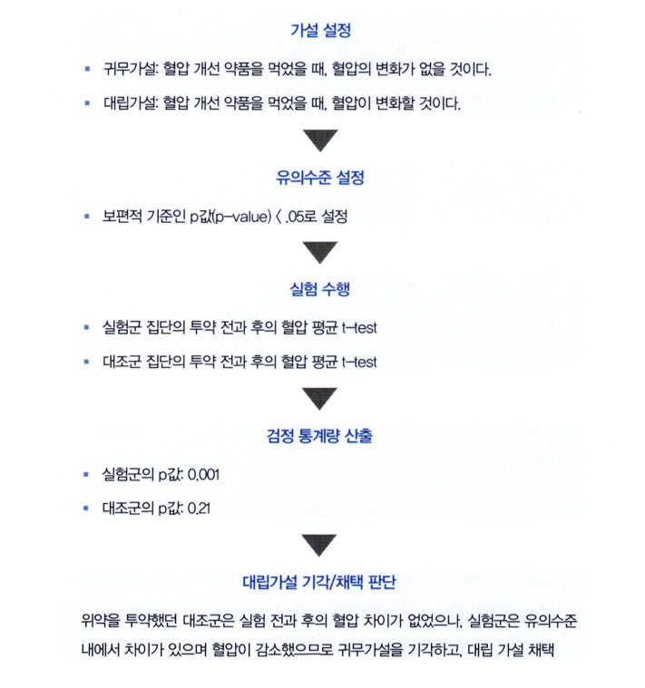
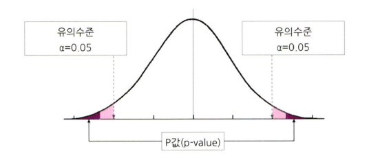
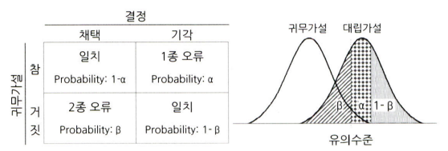

# 통계학 2주차 정규과제

📌통계학 정규과제는 매주 정해진 분량의 『*데이터 분석가가 반드시 알아야 할 모든 것*』 을 읽고 학습하는 것입니다. 이번 주는 아래의 **Statistics_2nd_TIL**에 나열된 분량을 읽고 `학습 목표`에 맞게 공부하시면 됩니다.

아래의 문제를 풀어보며 학습 내용을 점검하세요. 문제를 해결하는 과정에서 개념을 스스로 정리하고, 필요한 경우 추가자료와 교재를 다시 참고하여 보완하는 것이 좋습니다.

2주차는 `1부. 데이터 기초체력 기르기`를 읽고 새롭게 배운 내용을 정리해주시면 됩니다.


## Statistics_2nd_TIL

### 1부. 데이터 기초체력 기르기
### 06. 확률분포
### 07. 가설검정

## Study Schedule

|주차 | 공부 범위     | 완료 여부 |
|----|----------------|----------|
|1주차| 1부 p.2~56     | ✅      |
|2주차| 1부 p.57~79    | ✅      | 
|3주차| 2부 p.82~120   | 🍽️      | 
|4주차| 2부 p.121~202  | 🍽️      | 
|5주차| 2부 p.203~254  | 🍽️      | 
|6주차| 3부 p.300~356  | 🍽️      | 
|7주차| 3부 p.357~615  | 🍽️      |

<!-- 여기까진 그대로 둬 주세요-->

# 06. 확률분포

```
✅ 학습 목표 :
* 이산확률분포의 종류와 특징을 설명할 수 있다.
* 연속확률분포의 종류와 특징을 설명할 수 있다. 
* 중심극한정리(CLT)의 개념을 이해하고 설명 할 수 있다.
```

## 6.2. 이산확률분포

> **🧚 이산확률분포에 대해 학습한 내용을 정리해주세요.**

<!--수식과 공식을 암기하기보다는 분포의 개념과 특성을 위주로 공부해주세요. 분석 대상의 데이터가 어떠한 확률분포의 특성을 가지고 있는지를 아는 것이 더 중요합니다.-->

> 이산확률분포
- 실수와 같이 명확한 값을 갖는 분포

> 종류
- 균등분포(uniform distribution)
    - 동일한 확률을 가지는 분포
- 이항분포(binomial distribution)
    - 1과 0의 값만을 갖는 분포
    - 복원추출 : 표본에서 하나를 추출하고선 다시 표본에 포함시키고 추출하는 방법
- 초기하분포(hypergeometric distribution)
    - 각 시행이 서로 독립적이지 않아서 시행마다 성공할 확률이 달라진다다
    - 비복원추출
- 포아송분포(poisson distribution)
    - 일정한 관측 공간에서 특정 사건이 발생하는 횟수를 나타내는 이산확률분포

## 6.3. 연속확률분포

> **🧚 연속확률분포에 대해 학습한 내용을 정리해주세요.**

<!--수식과 공식을 암기하기보다는 분포의 개념과 특성을 위주로 공부해주세요. 분석 대상의 데이터가 어떠한 확률분포의 특성을 가지고 있는지를 아는 것이 더 중요합니다.-->

> 연속확률분포(continuous probability distribution)
- 연속적인 공간 안에 확률변수가 가질 수 있는 값이 무한히 많기 때문에, 특정한 값을 가질 확률이 0으로 수렴함

> 정규분포(normal distribution)
- 평균을 중심으로 좌우 대칭의 종 모양의 형태
- 평균과 중앙값, 최빈값이 같다
- 표준화된 정규분포 : 표준정규분포(standard normal distribution), 각기 다른 정규분포간 비교의 동질성을 만들기 위해 평균이 0, 분산이 1인 표준정규분포의 형태로 변환 해줌

> 지수분포(exponential distribution)
- 특정 사건이 발생한 시점으로부터 다음 사건이 발생할 때까지의 시간을 확률변숫값으로 하는 분포포

## 6.4. 중심극한정리

> **🧚 중심극한정리에 대해 학습한 내용을 정리해주세요.**

> 중심극한정리(Central Limit Theorem, CLT)
- 추정과 가설검정을 위한 핵심적인 이론
- 표본 크기가 특정 수준(일반적으로 30개 이상)을 초과하면 표본 평균의 분포는 중심 극한 정리로 인해 정규 분포에 가까워짐

# 07. 가설검정

```
✅ 학습 목표 :
* 귀무가설과 대립가설의 개념을 정의하고, 주어진 연구 질문에 적절한 가설을 설정할 수 있다.
* 가설검정의 유의수준과 p값의 개념을 설명하고, p값을 해석하여 귀무가설을 기각할지 여부를 판단할 수 있다.
* 1종 오류와 2종 오류의 차이를 설명하고, 실제 사례에서 어떤 오류를 더 중요하게 고려해야 하는지 판별할 수 있다.
```

<!-- 새롭게 배운 내용을 자유롭게 정리해주세요.-->

> 귀무가설과 대립가설
- 귀무가설(Null hypothesis)
    - H0, 새로이 증명하고자 하는 가설과 반대되는 가설
    - 집단 간 차이가 없거나 변수의 영향력이 없는 상태
    - 증명하고자 하는 가설과 반대되는 가설로써, 효과와 차이가 없는 가설을 의미
- 대립가설(Alternative hypothesis)
    - H1, 귀무가설과 대립되는 결과에 대한 가설
    - 귀무가설이 기각됐을 때 대안적으로 채택되는 가설(귀무가설과 반대되는 가설)

> 가설검정의 절차
- 

> 가설검정의 유의수준과 p값
- 가설 검정 : 모집단에 대한 가설이 통계적으로 옳은가를 판별하기 위한 방법
- 귀무가설에 대한 p값(p-value)이 유의수준(Significance level) 안에 들어오는지에 따라 가설의 기각과 채택을 판별
- 
- 신뢰수준(Confidence level) : 유의수준과 반대되는 기준
- 귀무가설의 기각역을 어느쪽으로 설정하는가에 따라
    - 왼쪽꼬리 검정(단측검정, '크거나 작다')
    - 오른쪽 꼬리 검정(단측검정, '크거나 작다')
    - 양측 검정(양측검정, '다르다')

> 1종 오류와 2종 오류
- 1종 오류(Type I Error)
    - 귀무가설이 참임에도 불구하고 귀무가설을 기각하는 오류
    - 실제로 효과가 없는데 효과가 있다고 판단
- 2종 오류(Type II Error)
    - 귀무가설이 거짓임에도 불구하고 귀무가설을 채택하는 오류
    - 실제로 효과가 있는데 효과가 없다고 판단
- 

<br>
<br>

# 확인 문제

## 문제 1.

> **🧚Q. 다음 중 귀무가설(H₀)을 기각해야 하는 경우는 언제인가요? 정답을 고르고, 그 이유를 간단히 설명해주세요.**

> **1️⃣ 유의수준(α)이 0.05이고, p값이 0.03일 때   
2️⃣ 유의수준(α)이 0.01이고, p값이 0.02일 때**

```
정답 : 1️⃣
(p값 ≤ α: 귀무가설 기각, p값 > α: 귀무가설 기각하지 않음)

--answer
# 가설검정의 기본 원칙
- p값 < 유의수준 : 귀무가설 기각 (통계적으로 유의미한 차이가 있음)
- p값 > 유의수준 : 귀무가설 기각하지 않음

# 답: 1
```

### 🎉 수고하셨습니다.
