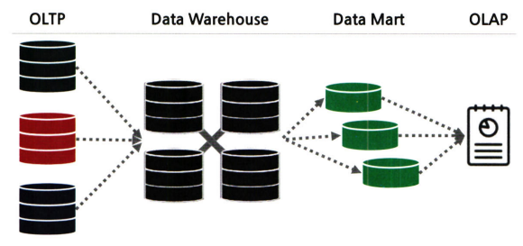
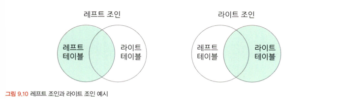
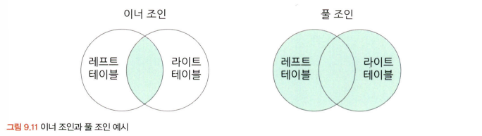
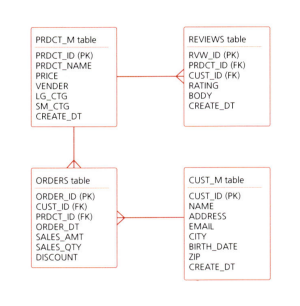
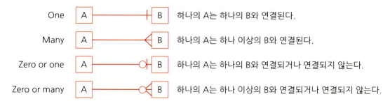

# 통계학 3주차 정규과제

📌통계학 정규과제는 매주 정해진 분량의 『*데이터 분석가가 반드시 알아야 할 모든 것*』 을 읽고 학습하는 것입니다. 이번 주는 아래의 **Statistics_3rd_TIL**에 나열된 분량을 읽고 `학습 목표`에 맞게 공부하시면 됩니다.

아래의 문제를 풀어보며 학습 내용을 점검하세요. 문제를 해결하는 과정에서 개념을 스스로 정리하고, 필요한 경우 추가자료와 교재를 다시 참고하여 보완하는 것이 좋습니다.

2주차는 `2부-데이터 분석 준비하기`를 읽고 새롭게 배운 내용을 정리해주시면 됩니다.


## Statistics_3rd_TIL

### 2부. 데이터 분석 준비하기
### 08. 분석 프로젝트 준비 및 기획
### 09. 분석 환경 세팅하기


## Study Schedule

|주차 | 공부 범위     | 완료 여부 |
|----|----------------|----------|
|1주차| 1부 p.2~56     | ✅      |
|2주차| 1부 p.57~79    | ✅      | 
|3주차| 2부 p.82~120   | ✅      | 
|4주차| 2부 p.121~202  | 🍽️      | 
|5주차| 2부 p.203~254  | 🍽️      | 
|6주차| 3부 p.300~356  | 🍽️      | 
|7주차| 3부 p.357~615  | 🍽️      |  

<!-- 여기까진 그대로 둬 주세요-->

# 08. 분석 프로젝트 준비 및 기획

```
✅ 학습 목표 :
* 데이터 분석 프로세스를 설명할 수 있다.
* 비즈니스 문제를 정의할 때 주의할 점을 설명할 수 있다.
* 외부 데이터를 수집하는 방법에 대해 인식한다.
```
<!-- 새롭게 배운 내용을 자유롭게 정리해주세요.-->

> 데이터 분석 프로세스를 설명할 수 있다.

**데이터 분석의 3단계**
1. 설계 단계
    - 데이터 분석에 들어가기에 앞서 무엇을 하고자 하는지를 명확히 정의하고 프로젝트를 수행할 인력을 구성한다.
2. 분석 및 모델링 단계
    - 데이터 분석 및 모델링을 위한 서버 환경을 마련하고 본격적인 데이터 분석과 모델링을 한다.
3. 구축 및 활용 단계
    - 최종적으로 선정된 분석 모델을 실제 업무에 적용하고 그성과를 측정한다.

> 비즈니스 문제를 정의할 때 주의할 점을 설명할 수 있다.

- 비즈니스 이해 및 문제 정의가 조금이라도 잘못되면 최종 인사이트 도출 및 솔루션 적용 단계에서 제대로 된 효과를 보기 힘들다.
    - 비즈니스 문제는 명확하고 직관적인 한 문장으로 정리할 수 있어야 한다.
    - 비즈니스 문제는 현상에 대한 설명으로 끝나서는 안 되고, 본질적인 문제점이 함께 전달되어야 하는 것이다.

> 외부 데이터를 수집하는 방법에 대해 인식한다.

1. 데이터 구매
    - 비용이 많이 들거나 절차가 복잡한 단점이 있지만 어느 정도 정제된 고품질의 데이터를 얻을 수 있다.
2. 오픈 데이터 수집
    - 데이터 수집에 특별한 비용이나 노력이 크게 들어가지 않는 장점이 있지만 데이터를 원하는 형태로 가공하기 위한 리소스가 많이 들 수 있고 활용성이 높은 데이터를 얻을 확률이 낮은 편이다.
3. 크롤링
    - 원하는 데이터를 실시간으로 자유롭게 수집할 수 있다는 장점이 있지만, 데이터 수집을 위한 프로그래밍이 필요하며 해당 웹페이지가 리뉴얼되면 이에 맞춰 수집 코드도 수정해야 한다.

# 09. 분석 환경 세팅하기

```
✅ 학습 목표 :
* 데이터 분석의 전체적인 프로세스를 설명할 수 있다.
* 테이블 조인의 개념과 종류를 이해하고, 각 조인 방식의 차이를 구분하여 설명할 수 있다.
* ERD의 개념과 역할을 이해하고, 기본 구성 요소와 관계 유형을 설명할 수 있다.
```

<!-- 새롭게 배운 내용을 자유롭게 정리해주세요.-->

> 데이터 분석의 전체적인 프로세스를 설명할 수 있다.
- 
- OLTP(On-Line Transaction Processing) : 실시간으로 데이터를 트랜잭션 단위로 수집, 분류, 저장하는 시스템
- DW(Data Warehouse) : 수집된 데이터를 사용자 관점에서 주제별로 통합하여 쉽게 원하는 데이터를 빼낼 수 있도록 저장해 놓은 통합 데이터베이스
- DM(Data Mart) : 사용자의 목적에 맞도록 가공된 일부의 데이터가 저장되는 곳

> 테이블 조인의 개념과 종류를 이해하고, 각 조인 방식의 차이를 구분하여 설명할 수 있다.
- left join & right join
    - 하나의 테이블을 기준으로 다른 테이블에서 겹치는 부분을 결합해 준다.
    - 기준이 되는 테이블의 데이터는 그대로 유지하면서 조인하는 테이블의 데이터만 추가되는 것.
    - 
- inner join & full join
    - 이너 조인 : 두 테이블 간에 겹치는 부분의 행만 가져오는 조인 방법
    - 풀 조인 : 모든 행을 살리는 조인 방법, 조인되지 않은 부분은 결측값이 된다.
    - 
- cross join
    - 값이 없더라도 모든 행이 생기도록 데이터 가공을 해야 할 때 사용한다.

> ERD의 개념과 역할을 이해하고, 기본 구성 요소와 관계 유형을 설명할 수 있다.

**ERD**
- Entity Relationship Diagram
- 
- 각 테이블의 구성 정보와 테이블 간 관계를 도식으로 표현한 그림 형태로 구성되어 있다.
- 
- 테이블 간에는 1:1로 매칭되는 경우도 있고 1:N, N:N 등으로 연결된 경우도 많기 때문에 이러한 관계를 정확히 파악하고 데이터를 다뤄야 한다.

**키 칼럼**
- 기본 키(Primary Key)
    - 테이블에 적재된 각각의 데이터를 유일하게 구분하는 키
    - 해당 테이블에서 유일하게 구분되는 칼럼이므로 중복될 수 없으며 결측값을 가질 수 없다.
- 외래 키(Foreign Key)
    - 각 테이블 간에 연결을 만들기 위해서 테이블에서 다른 테이블의 참조되는 기본 키
    - 다른 테이블과 연결하기 위한 칼럼이므로 중복이나 결측값이 있을 수 있으며 외래 키가 정의된 테이블은 자식테이블, 참조되는 테이블은 부모 테이블이라 부른다.
- 슈퍼 키(Super Key)
    - 테이블에서 각 행을 유일하게 식별할 수 있는 하나의 키 혹은 조합된 키
- 후보 키(Candidate Key)
    - 기본키의 조건인 유일성과 최소성을 만족하지만 기본키는 아닌 후보키


<br>
<br>

# 확인 문제

## 문제 1.

> **🧚 아래의 테이블을 조인한 결과를 출력하였습니다. 어떤 조인 방식을 사용했는지 맞춰보세요.**

> 사용한 테이블은 다음과 같습니다.

|
---|---|

> 보기: INNER, LEFT, RIGHT 조인

<!-- 테이블 조인의 종류를 이해하였는지 확인하기 위한 문제입니다. 각 테이블이 어떤 조인 방식을 이용하였을지 고민해보고 각 테이블 아래에 답을 작성해주세요.-->

### 1-1. 

```
LEFT 조인
```

### 1-2. 

```
INNER 조인
```

### 1-3. 

```
RIGHT 조인
```

### 🎉 수고하셨습니다.
