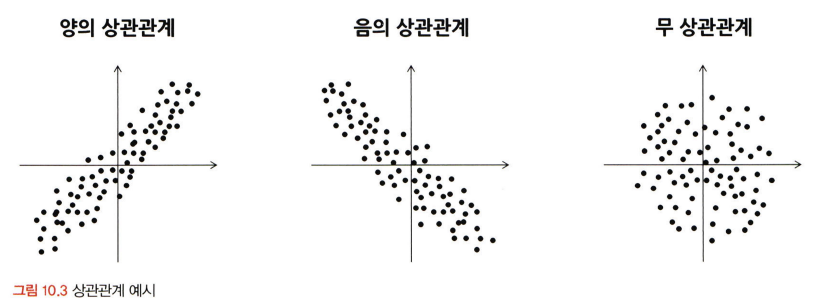
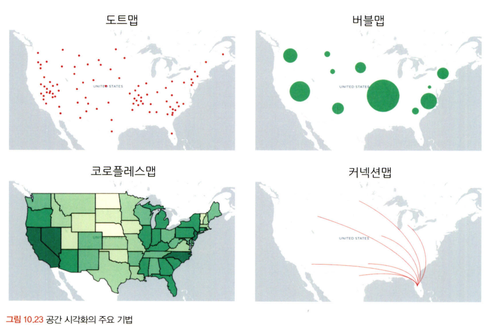

# 통계학 4주차 정규과제

📌통계학 정규과제는 매주 정해진 분량의 『*데이터 분석가가 반드시 알아야 할 모든 것*』 을 읽고 학습하는 것입니다. 이번 주는 아래의 **Statistics_4th_TIL**에 나열된 분량을 읽고 `학습 목표`에 맞게 공부하시면 됩니다.

아래의 문제를 풀어보며 학습 내용을 점검하세요. 문제를 해결하는 과정에서 개념을 스스로 정리하고, 필요한 경우 추가자료와 교재를 다시 참고하여 보완하는 것이 좋습니다.

4주차는 `2부. 데이터 분석 준비하기`를 읽고 새롭게 배운 내용을 정리해주시면 됩니다.


## Statistics_4th_TIL

### 2부. 데이터 분석 준비하기
### 10. 데이터 탐색과 시각화


## Study Schedule

|주차 | 공부 범위     | 완료 여부 |
|----|----------------|----------|
|1주차| 1부 p.2~56     | ✅      |
|2주차| 1부 p.57~79    | ✅      | 
|3주차| 2부 p.82~120   | ✅      | 
|4주차| 2부 p.121~202  | ✅      | 
|5주차| 2부 p.203~254  | 🍽️      | 
|6주차| 3부 p.300~356  | 🍽️      | 
|7주차| 3부 p.357~615  | 🍽️      | 

<!-- 여기까진 그대로 둬 주세요-->

# 10. 데이터 탐색과 시각화

```
✅ 학습 목표 :
* EDA의 목적을 설명할 수 있다.
* 주어진 데이터셋에서 이상치, 누락값, 분포 등을 식별하고 EDA 결과를 바탕으로 데이터셋의 특징을 해석할 수 있다.
* 공분산과 상관계수를 활용하여 두 변수 간의 관계를 해석할 수 있다.
* 적절한 시각화 기법을 선택하여 데이터의 특성을 효과적으로 전달할 수 있다.
```
<!-- 새롭게 배운 내용을 자유롭게 정리해주세요.-->

> EDA의 목적
EDA를 할 때는 극단적인 해석은 피해야 하며 지나친 추론이나 자의적 해석도 지양해야 한다.
- 데이터의 형태와 척도가 분석에 알맞게 되어있는지 확인(sanity checking)
- 데이터의 평균, 분산, 분포, 패턴 등의 확인을 통해 데이터 특성 파악
- 데이터의 결측값이나 이상치 파악 및 보완
- 변수 간의 관계성 파악
- 분석 목적과 방향성 점검 및 보정

> 이상치, 누락값, 분포 등 식별 및 EDA 결과를 바탕으로 데이터셋의 특징 해석
```py
# 데이터 샘플 확인
df.head()

# 각 칼럼의 속성 및 결측치 확인
df.info()

# 각 컬럼의 통계치 확인
df.describe()

# 각 컬럼의 왜도 확인
df.skew()

# 각 컬럼의 첨도 확인
df.kurtosis()

# 특정 변수 분포 시각화
sns.distplot(df['~'])
```

> 공분산과 상관계수
- 
- 공분산(Covariance)
    - 서로 공유하는 분산
    - 양의 상관관계: X1이 커지면 X2도 커진다.
    - 음의 상관관계: X1이 커지면 X2는 작아진다.
    - 무 상관관계: X1과 X2는 선형적인 관계가 없다.
- 상관계수(Correlation coefficient)
    - 상관성을 비교
    - 상관계수에 따른 해석
        - 0 : Zero
        - 0.1~0.3 : Weak
        - 0.4~0.6 : Moerate
        - 0.7~0.9 : Strong
        - 1 : Perfect

> 시각화 기법
- 시간 시각화
    - 시점 요소가 있는 데이터는 시계열(Time series) 형태로 표현할 수 있다.
    - 선그래프 : 시간 간격의 밀도가 높을 때 사용
    - 누적 막대그래프 : 한 시점에 2개 이상의 세부 항목이 존재할 때 사용
- 비교 시각화
    - 히트맵 차트 : 그룹과 비교 요소가 많을 때 효과적으로 시각화를 할 수 있는 방법
    - 방사형 차트
    - 평행 좌표 그래프 : 변수별 값을 정규화하면 보다 효과적으로 표현 가능
- 분포 시각화
    - 연속형과 같은 양적 척도
        - 막대그래프
        - 선그래프
        - 히스토그램
    - 명목형과 같은 질적 척도
        - 파이차트
        - 도넛차트
        - 트리맵 차트 : 구성 요소가 복잡한 질적 척도 표현시
- 관계 시각화
    - 산점도
    - 버블 차트 : 세 가지 요소의 상관관게 표현 가능
- 공간 시각화
    - 
- 박스 플롯 : 하나의 그림으로 양적 척도 데이터의 분포 및 편향성, 평균과 중앙값 등 다양한 수치를 보기 쉽게 정리해 준다.

<br>
<br>

# 확인 문제

## 문제 1.
> **🧚 공분산과 상관계수의 차이점에 대해 간단히 설명하세요.**

```
각 변수의 변동이 얼마나 닮았는지를 표현한다는 점에서 같지만, 계산 방식에 있어서 약간의 차이가 있다.
공분산은 각 변수 간의 다른 척도기준이 그대로 반영되어 직관적으로 상관성의 높고 낮음을 파악하기 힘들다.

--answer
# 공분산은 두 변수 간의 선형 관계를 측정하며, 단위가 있다(두 변수의 단위 곱).
# 상관계수는 공분산을 표준화한 값으로, 단위가 없으며 항상 -1과 1 사이의 값을 가진다.
```

## 문제 2.
> **🧚 다음 데이터 분석 목표에 적합한 시각화 방법을 보기에서 모두 골라 연결해주세요.**

> 보기: 산점도, 선그래프, 막대그래프, 히스토그램, 박스플롯

(a) 변수의 분포 확인   
(b) 두 변수 간의 관계 확인   
(c) 집단별 평균 비교   
(d) 시계열 데이터 분석

<!--중복 가능-->

```
(a) - 선그래프, 막대그래프, 히스토그램
(b) - 산점도
(c) - 박스플롯
(d) - 선그래프

--answer
(a) 변수의 분포 확인: 범주형 - 막대그래프 / 연속형 - 히스토그램, 박스플롯
(b) 두 변수 간의 관계 확인: 산점도(수치형-수치형) / 박스플롯(범주형-수치형) / 막대그래프(범주형-범주형)
(c) 집단별 평균 비교: 막대그래프, 박스플롯, (산점도)
(d) 시계열 데이터 분석: 막대그래프, 선그래프
```


### 🎉 수고하셨습니다.
