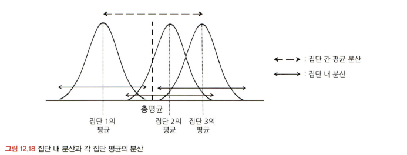

# 통계학 6주차 정규과제

📌통계학 정규과제는 매주 정해진 분량의 『*데이터 분석가가 반드시 알아야 할 모든 것*』 을 읽고 학습하는 것입니다. 이번 주는 아래의 **Statistics_6th_TIL**에 나열된 분량을 읽고 `학습 목표`에 맞게 공부하시면 됩니다.

아래의 문제를 풀어보며 학습 내용을 점검하세요. 문제를 해결하는 과정에서 개념을 스스로 정리하고, 필요한 경우 추가자료와 교재를 다시 참고하여 보완하는 것이 좋습니다.

6주차는 `3부. 데이터 분석하기`를 읽고 새롭게 배운 내용을 정리해주시면 됩니다.


## Statistics_6th_TIL

### 3부. 데이터 분석하기
### 12.통계 기반 분석 방법론


## Study Schedule

|주차 | 공부 범위     | 완료 여부 |
|----|----------------|----------|
|1주차| 1부 p.2~56     | ✅      |
|2주차| 1부 p.57~79    | ✅      | 
|3주차| 2부 p.82~120   | ✅      | 
|4주차| 2부 p.121~202  | ✅      | 
|5주차| 2부 p.203~254  | ✅      | 
|6주차| 3부 p.300~356  | ✅      | 
|7주차| 3부 p.357~615  | 🍽️      |

<!-- 여기까진 그대로 둬 주세요-->

# 12.통계 기반 분석 방법론

```
✅ 학습 목표 :
* 주성분 분석(PCA)의 개념을 설명할 수 있다.
* 다중공선성을 진단할 수 있다.
* Z-TEST와 T-TEST의 개념을 비교하고, 적절한 상황에서 검정을 설계하고 수행할 수 있다.
* ANOVA TEST를 활용하여 세 개 이상의 그룹 간 평균 차이를 검정하고, 사후검정을 수행할 수 있다.
* 카이제곱 검정을 통해 범주형 변수 간의 독립성과 연관성을 분석하는 방법을 설명할 수 있다.
```

## 12.1. 분석 모델 개요
<!-- 새롭게 배운 내용을 자유롭게 정리해주세요.-->
- 통계 모델(Statistical models)
    - 모형과 해석을 중요하게 생각하며, 오차와 불확정성을 강조한다.
- 기계 학습(Machine learning)
    - 대용량 데이터를 활용하여 예측의 정확도를 높이는 것을 중요하게 생각한다.

- 기계 학습 데이터 분석 방법론
    - 종속변수의 유무
        - 지도학습(Supervised learning)
        - 비지도 학습(Unsupervised learning)
            - 별도의 정답이 없이 변수 간의 패턴을 파악하거나 데이터를 군집화하는 방법
        - 강화학습(Reinforcement learning)
            - 동물이 시행착오(trial and error)를 통해 학습하는 과정을 기본 콘셉트로 한 방법 중 하나
    - 독립변수와 종속변수의 속성
        - 회귀(Regression) 방식
        - 분류(Classification) 방식
        - k-근접이웃 모델


## 12.2. 주성분 분석(PCA)
<!-- 새롭게 배운 내용을 자유롭게 정리해주세요.-->
- 주성분 분석(Principal Component Analysis; PCA)
    - 여러 개의 독립변수들을 잘 설명해 줄 수 있는 주된 성분을 추출하는 기법
    - 차원의 저주(curse of dimensionality)를 방지하기 위한 방법
    -  데이터 공간에 위치하는 점들의 분산을 최대한 보존하는 축을 통해 차원을 축소하는 것이 핵심 요소
- 차원을 감소하는 방법
    - 변수 선택을 통해 비교적 불필요하거나 유의성이 낮은 변수를 제거하는 방법
    - 변수들의 잠재적인 성분을 추출하여 차원을 줄이는 방법
        - 주성분 분석
        - 공통요인분석(Common Factor Analysis;CFA)

## 12.4. 다중공선성 해결과 섀플리 밸류 분석
<!-- 새롭게 배운 내용을 자유롭게 정리해주세요.-->
- 다중공선성(multicollinearity)
    - 독립변수들 간의 상관관계가 높은 현상
    - 두 개 이상의 독립변수가 서로 선형적인 관계를 나타낼 때
    - 추정치의 통계적 유의성이 낮아져 모델의 정합성이 맞지 않는 문제 발생

- 다중공선성을 판별하는 기준
    - 회귀 분석 모델을 실행하기 전에 상관분석을 통해 독립 변수 간의 상관성을 확인하여 높은 상관계수를 갖는 독립변수를 찾아내는 방법
    - 회귀분석 결과에서 독립변수들의 설명력을 의미하는 결정계수 R**2 값은 크지만 회귀계수에 대한 t값(t-value)이 낮은 경우
    -  VIF(Variance Inflation Factor), 분산팽창계수

- 다중공선성 해결 방법
    -  VIF값이 높으면서 종속변수와의 상관성(설명력)이 낮은 변수 제거
    - 표본 관측치를 추가적으로 확보
    - 로그, 표준화 등을 통한 변수 가공
    - 주성분분석을 통한 변수 축약
    - 변수 선택 알고리즘을 활용하여 적정 변수 자동 선정

- 섀플리 밸류(Shapley Value)
    - 각 독립변수가 종속변수의 설명력에 기여하는 순수한 수치를 계산하는 방법
    -  해당 변수를 모델에 투입했을 때 설명력에 어느 정도의 기여를 하는지 측정할 수 있는 기준값으로 활용할 수 있다.

## 12.6. Z-test와 T-test
<!-- 새롭게 배운 내용을 자유롭게 정리해주세요.-->
- Z-test와 T-test
    - 단일 표본 집단의 평균 변화를 분석하거나 두 집단의 평균값 혹은 비율 차이를 분석할 때 사용한다. 
    -  Z-test는 본래 모집단의 분산을 알 수 있는 경우에 사용되지만, 모집단의 분산을 알 수 있는 경우는 보통 거의 없다.
    -  T-test는 표본의 크기가 30 미만이어서 표본 집단의 정규분포를 가정할 수 없을 때 사용된다. 


## 12.7. ANOVA
<!-- 새롭게 배운 내용을 자유롭게 정리해주세요.-->
- ANOVA(Analysis of Variance), 분산 분석
    - 세 집단 이상의 평균 차이를 검정할 때 사용
    - 각 집단의 평균값 차이가 통계적으로 유의한지 검증한다.
    - 각 집단의 평균이 서로 멀리 떨어져 있어 집단 평균의 분산이 큰 정도를 따져서 집단 간 평균이 다른지를 판별한다.
    - 


## 12.8. 카이제곱 검정(교차분석)
<!-- 새롭게 배운 내용을 자유롭게 정리해주세요.-->
- 카이제곱 검정(Chi-square test), 교차분석(Crosstabs)
    - 명목 혹은 서열척도와 같은 범주형 변수들 간의 연관성을 분석하기 위해 결합분포를 활용하는 방법
    - 기본 원리는 변수들 간의 범주를 동시에 교차하는 교차표를 만들어 각각의 빈도와 비율을 통해 변수 상호 간의 독립성과 관련성을 분석하는 것


<br>
<br>

# 확인 문제

### **문제 1.**
> **🧚 경희는 다트비 교육 연구소의 연구원이다. 경희는 이번에 새롭게 개발한 교육 프로그램이 기존 프로그램보다 학습 성취도 향상에 효과적인지 검증하고자 100명의 학생을 무작위로 두 그룹으로 나누어 한 그룹(A)은 새로운 교육 프로그램을, 다른 그룹(B)은 기존 교육 프로그램을 수강하도록 하였다. 실험을 시작하기 전, 두 그룹(A, B)의 초기 시험 점수 평균을 비교한 결과, 유의미한 차이가 없었다. 8주 후, 학생들의 최종 시험 점수를 수집하여 두 그룹 간 평균 점수를 비교하려고 한다.**   

> **🔍 Q1. 이 실험에서 사용할 적절한 검정 방법은 무엇인가요?**

```
t-test

--answer
독립표본 T-TEST
```

> **🔍 Q2. 이 실험에서 설정해야 할 귀무가설과 대립가설을 각각 작성하세요.**

```
귀무가설 : 새로운 교육 프로그램과 기존 교육 프로그램의 학습 성취도 평균은 같다.
대립가설 : 두 프로그램의 학습 성취도 평균은 다르다.

--answer
# 귀무가설(H₀): 새로운 교육 프로그램을 수강한 학생들의 평균 점수는 기존 교육 프로그램을 수강한 학생들의 평균 점수와 차이가 없다.  

# 대립가설(H₁): 새로운 교육 프로그램을 수강한 학생들의 평균 점수는 기존 교육 프로그램을 수강한 학생들의 평균 점수보다 높다. → 단측 검정
```

> **🔍 Q3. 검정을 수행하기 위한 절차를 순서대로 서술하세요.**

<!--P.337의 실습 코드 흐름을 확인하여 데이터를 불러온 후부터 어떤 절차로 검정을 수행해야 하는지 고민해보세요.-->

```
각 컬럼의 통곗값 확인 - 데이터 정규성 검정 - 데이터 등분산성 검정 - Z-test - 대응표본 t검정 수행 - 독립표본 t검정 수행

--answer
(1) 데이터 탐색 
   - 각 그룹(A, B)의 표본 크기 확인  
   - 기술통계량(평균, 표준편차, 최소값, 최대값) 확인  
   - 결측값 확인 및 처리  

(2) 정규성 검정
   - 두 그룹의 점수 분포가 정규성을 만족하는지 확인 (Shapiro-Wilk 검정 또는 Kolmogorov-Smirnov 검정)  

(3) 등분산 검정
   - 두 그룹의 분산이 동일한지 확인 (Levene’s Test 또는 F-test)  
   - 등분산이 만족되지 않으면 Welch’s T-TEST 수행  

(4) 독립표본 T-TEST 수행
   - 유의수준(α) 설정 
   - t-검정 수행 후 p-value 확인  

(5) 결과 해석 및 결론 도출
   - p-value < 0.05 → 귀무가설 기각 (새로운 교육 프로그램이 효과적)  
   - p-value ≥ 0.05 → 귀무가설 채택 (새로운 교육 프로그램의 효과가 유의미하지 않음) 
```

> **🔍 Q4. 이 검정을 수행할 때 가정해야 하는 통계적 조건을 설명하세요.**

```
1. 두 표본은 서로 독립적이어야 한다.
2. 각 그룹의 데이터는 정규분포를 따라야 한다.
3. 두 그룹의 분산이 같아야 한다.

--answer
- 모집단이 정규분포를 따른다 (표본 크기가 30 이상이면 중심극한정리에 의해 근사적으로 정규성 가정 가능).  
- 두 그룹의 점수 데이터가 독립적이다.  
- 두 그룹의 분산이 유사해야 한다 (등분산 가정, 필요 시 Welch’s T-TEST 사용).
```

> **🔍 Q5. 추가적으로 최신 AI 기반 교육 프로그램(C)도 도입하여 기존 프로그램(B) 및 새로운 프로그램(A)과 비교하여 성취도 차이가 있는지 평가하고자 한다면 어떤 검정 방법을 사용해야 하나요? 단, 실험을 시작하기 전, C 그룹의 초기 점수 평균도 A, B 그룹과 유의미한 차이가 없었다고 가정한다.**

```
ANOVA
```

> **🔍 Q6. 5번에서 답한 검정을 수행한 결과, 유의미한 차이가 나타났다면 추가적으로 어떤 검정을 수행해 볼 수 있을까요?**

```
각 집단의 수가 같을 때 사용하는 Turkey의 HSD 검증,
집단의 수가 다를 때 사용하는 Scheffe 검증 

--answer
ANOVA 결과가 유의미하다면, 어떤 그룹 간 차이가 존재하는지 확인하기 위해 사후검정을 수행해야 한다.

# Tukey's HSD Test: 모든 그룹 쌍을 비교하여 차이가 있는지 확인할 때 사용 (집단 크기가 유사할 때 적절).

# Scheffe Test: 집단 크기가 다를 때도 유효한 방법.
```

---

### **문제 2. 카이제곱 검정**  
> **🧚 다음 중 어떠한 경우에 카이제곱 검정을 사용해야 하나요?   
1️⃣ 제품 A, B, C의 평균 매출 차이를 비교하고자 한다.  
2️⃣ 남성과 여성의 신체 건강 점수 평균 차이를 분석한다.  
3️⃣ 제품 구매 여부(구매/미구매)와 고객의 연령대(10대, 20대, 30대…) 간의 연관성을 분석한다.  
4️⃣ 특정 치료법이 환자의 혈압을 감소시키는 효과가 있는지 확인한다.**  

```
3️⃣

--answer
답: 3️⃣

해설:  
- 카이제곱 검정은 두 개 이상의 범주형 변수 간 연관성을 분석하는 기법이다.  
- 1️⃣, 2️⃣는 평균 차이 비교이므로 ANOVA나 t-검정이 적절하며, 4️⃣는 회귀 분석이 더 적합하다. 
```

### 🎉 수고하셨습니다.
