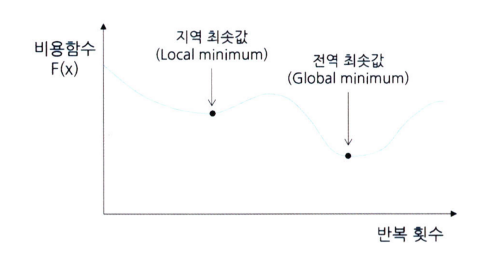
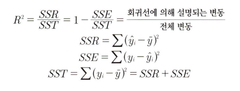
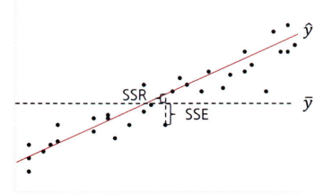
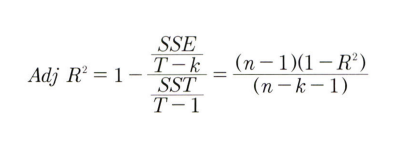
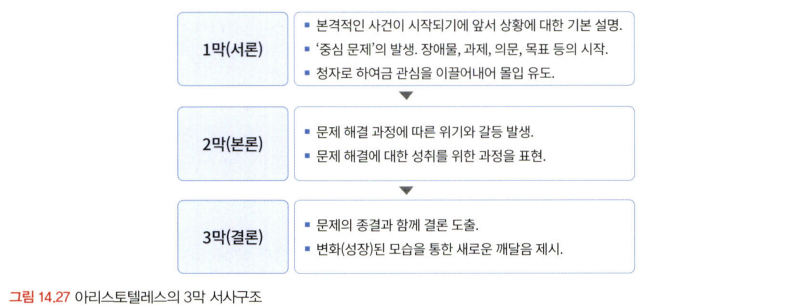

# 통계학 7주차 정규과제

📌통계학 정규과제는 매주 정해진 분량의 『*데이터 분석가가 반드시 알아야 할 모든 것*』 을 읽고 학습하는 것입니다. 이번 주는 아래의 **Statistics_7th_TIL**에 나열된 분량을 읽고 `학습 목표`에 맞게 공부하시면 됩니다.

아래의 문제를 풀어보며 학습 내용을 점검하세요. 문제를 해결하는 과정에서 개념을 스스로 정리하고, 필요한 경우 추가자료와 교재를 다시 참고하여 보완하는 것이 좋습니다.

7주차는 `3부. 데이터 분석하기`를 읽고 새롭게 배운 내용을 정리해주시면 됩니다.


## Statistics_7th_TIL

### 3부. 데이터 분석하기
### 13.머신러닝 분석 방법론
### 14.모델 평가


## Study Schedule

|주차 | 공부 범위     | 완료 여부 |
|----|----------------|----------|
|1주차| 1부 p.2~56     | ✅      |
|2주차| 1부 p.57~79    | ✅      | 
|3주차| 2부 p.82~120   | ✅      | 
|4주차| 2부 p.121~202  | ✅      | 
|5주차| 2부 p.203~254  | ✅      | 
|6주차| 3부 p.300~356  | ✅      | 
|7주차| 3부 p.357~615  | ✅      | 

<!-- 여기까진 그대로 둬 주세요-->

# 13.머신러닝 분석 방법론

```
✅ 학습 목표 :
* 선형 회귀와 다항 회귀를 비교하고, 데이터를 활용하여 적절한 회귀 모델을 구축할 수 있다. 
* 로지스틱 회귀 분석의 개념과 오즈(Odds)의 의미를 설명하고, 분류 문제에 적용할 수 있다.
* k-means 알고리즘의 원리를 설명하고, 적절한 군집 개수를 결정하여 데이터를 군집화할 수 있다.
```

## 13.1. 선형 회귀분석과 Elastic Net(예측모델)
<!-- 새롭게 배운 내용을 자유롭게 정리해주세요.-->
<!-- `13.1.3. Ridge와 Lasso 그리고 Elastic Net` 부분은 제외하고 학습하셔도 무방합니다.-->
> 13.1.1 회귀분석의 기원과 원리
- 종속변수 Y의 값에 영향을 주는 독립변수 X들의 조건을 고려하여 구한 평균값
- 회귀선 : 예측치와 관측치들 간의 수직 거리(오차)의 제곱합을 최소로 하는 직선 ; 최소제곱추정법(Least squares estimation)
- 독립변수가 하나 : 단순 회귀분석, 단변량 회귀분석
- 독립변수가 두 개 이상 : 다중 회귀 분석, 다변량 회귀분석
    - 상관분석, VIF값 확인 등을 통해 다중공선성을 확인하고, 차원 축소나 변수 가공을 통해 이를 방지
- 기본 조건
    - 잔차의 정규성 : X(독립변수)에 해당되는 Y(종속변수)의 값들의 잔차는 정규분포를 해야 한다.
    - 잔차의 등분산성: 잔차의 분산은 회귀 모형의 독립 변숫값과 상관없이 일정해야 한다.
    - 독립성 : 독립변수들 간에 상관관계가 없어야 한다. (다중 선형회귀)
    - 선형성 : X(독립변수) 값의 변화에 따른 Y(종속변수) 값의 변화는 일정해야 한다.

> 13.1.2 다항 회귀(Polynomial regression)
- 다항회귀란 독립변수와 종속변수의 관계가 곡선형 관계일 대 변수에 각 특성의 제곱을 추가하여 회귀선을 곡선형으로 변환하는 모델
- 변수 선택 알고리즘
    - 전진 선택법
    - 후진 제거법
    - 단계적 선택법법

## 13.2. 로지스틱 회귀분석 (분류모델)
<!-- 새롭게 배운 내용을 자유롭게 정리해주세요.-->
- 어떤 카테고리에 들어갈지 분류를 하는 모델
- 기본 모형 : 종속변수과 0과 1이라는 이항(binary)으로 이루어져 있다.
- 다항 로지스틱 회귀분석 : 종속변수의 범주가 3개 이상

## 13.8. k-means 클러스터링(군집모델)
<!-- 새롭게 배운 내용을 자유롭게 정리해주세요.-->
- k 개의 중심점을 찍어서 관측치들 간의 거리를 최적화하여 군집화를 하는 모델
- 중심점과 군집 내 관측치 간의 거리를 비용함수로 하여, 이 함수 값이 최소화되도록 중심점과 군집을 반복적으로 재정의해 준다.
- 단계별 정리
    1. k 개의 중심점을 임의의 데이터 공간에 선정
    2. 각 중심점과 관측치들 간의 유클리드 거리를 계산
    3. 각 중심점과 거리가 가까운 관측치들을 해당 군집으로 할당
    4. 할당된 군집의 관측치들과 해당 중심점과의 유클리드 거리를 계산
    5. 중심점을 군집의 중앙으로 이동(군집의 관측치들 간 거리 최소 지점)
    6. 중심점이 더 이상 이동하지 않을 때까지 2~5단계 반복
- 지역 최솟값(Local minimun) 문제
    - 
    - 거리합이 최소화되는 전역 최솟값을 찾기 전에 지역 최솟값에서 알고리즘이 종료되는 것.
    - 이러한 지역 최솟값 문제를 방지하기 위해 초기 중심점 선정 방법을 다양하게 하여 최적의 모델을 선정할 수 있다.
- K 수를 정하는 방법
    1. 비즈니스 도메인 지식을 통한 개수 선정
    2. 엘보우 기법(Elbow method) : 군집 내 중심점과 관측치 간 거리 합이 급감하는 구간의 k 개수를 선정하는 방법
    3. 실루엣 계수(Shilhouette coefficient) : 군집 안의 관측치들이 다른 군집과 비교해서 얼마나 비슷한지를 나타내는 수치
- DBSCAN
    - 기준 밀도를 가진 관측치들을 기준으로 군집화를 하기 때문에 U자형과 같이 오목한 데이터나 H와 같은 모양을 띠는 데이터 분포도 효과적으로 군집화할 수 있다.
    - 군집이 명확하지 않은 이상치를 잘 분류해 낼 수 있다.

# 14. 모델 평가

```
✅ 학습 목표 :
* 유의확률(p-value)을 해석할 때 주의할 점을 설명할 수 있다.
* 분석가가 올바른 주관적 판단을 위한 필수 요소를 식별할 수 있다.
```

## 14.3. 회귀성능 평가지표
<!-- 새롭게 배운 내용을 자유롭게 정리해주세요.-->
> 14.3.1 R-Square와 Adjusted R-Square
- R-Square
    - 
    - SSR : 회귀식 추정값과 전체 실젯값 평균과의 편차 제곱합
    - SSE : 회귀식 추정값과 실젯값 편차 제곱의 합
    - SST : 실젯값과 전체 실젯값 평균과의 편차 제곱합
    - 
- Adjusted R-Square
    - 독립 변수의 개수가 많아질수록 값이 커지는 문제를 보정한 기준
    - 

## 14.6. 유의확률의 함정
<!-- 새롭게 배운 내용을 자유롭게 정리해주세요.-->
- p값은 표본의 크기가 커지면 점점 0으로 수렵하게 되는 특성이 있다.
- p값의 기준인 0.05는 통상적으로 쓰이는 임의적인 기준이기 때문에 0.05 미만으로 나왔다고 해서 통계적 유의성이 확실히 있다고 단언할 수 없다.
- 통계적 중요성 및 p값에 대한 성명서
    1. p값은 데이터가 통계 모델과 얼마나 호환되지 않는지를 나타낼 수 있다.
    2. p값은 연구 가설이 참일 확률 또는 데이터가 우연만으로 생성됐을 확률을 측정하지 않는다.
    3. 과학적 결론과 사업 또는 정책 결정은 p값이 특정 임곗값을 통과하는지에 기초해서는 안 된다.
    4. 적절한 추론에는 완전한 보고와 투명성이 필요하다.
    5. p값 또는 통계적 유의성은 효과의 크기나 결과의 중요성을 측정하지 않는다.
    6. p값은 그 자체로 모델이나 가설에 관한 증거에 대한 훌륭한 척도가 되지 않는다.

## 14.7. 분석가의 주관적 판단과 스토리텔링
<!-- 새롭게 배운 내용을 자유롭게 정리해주세요.-->
- 분석가의 올바른 주관적 판단을 위한 필수 요소
    - 해당 분야의 풍부한 도메인 지식
    - 통계적 지식을 기반으로 탐색적 데이터 분석(EDA)과 전처리
    - 적극적인 커뮤니케이션과 데이터, 모델 검증증
- 스토리텔링 구조
    - 배경-문제(위기)-극복-변화
    - 

<br>
<br>

# 확인 문제

## **문제 1. 선형 회귀**

> **🧚 칼 피어슨의 아버지와 아들의 키 연구 결과를 바탕으로, 다음 선형 회귀식을 해석하세요.**  
> 칼 피어슨(Karl Pearson)은 아버지(X)와 아들(Y)의 키를 조사한 결과를 바탕으로 아래와 같은 선형 회귀식을 도출하였습니다. 아래의 선형 회귀식을 보고 기울기의 의미를 설명하세요. 
>  
> **ŷ = 33.73 + 0.516X**  
>   
> - **X**: 아버지의 키 (cm)  
> - **ŷ**: 아들의 예상 키 (cm)  

```
아버지의 키가 1cm 증가할 때, 아들의 예상 키가 평균적으로 0.516cm 증가한다는 것을 의미한다.
```
---

## **문제 2. 로지스틱 회귀**  

> **🧚 다트비에서는 학생의 학업 성취도를 예측하기 위해 다항 로지스틱 회귀 분석을 수행하였습니다. 학업 성취도(Y)는 ‘낮음’, ‘보통’, ‘높음’ 3가지 범주로 구분되며, 독립 변수는 주당 공부 시간(Study Hours)과 출석률(Attendance Rate)입니다. 단, 기준범주는 '낮음' 입니다.**   

| 변수 | Odds Ratio Estimates | 95% Wald Confidence Limits |  
|------|----------------------|--------------------------|  
| Study Hours | **2.34** | (1.89, 2.88) |  
| Attendance Rate | **3.87** | (2.92, 5.13) |  

> 🔍 Q1. Odds Ratio Estimates(오즈비, OR)의 의미를 해석하세요.

<!--변수 Study Hours의 오즈비 값이 2.34라는 것과 Attendance Rate의 오즈비 값이 3.87이라는 것이 각각 무엇을 의미하는지 구체적으로 생각해보세요.-->

```
주당 공부 시간이 1시간 증가할 때, 학업 성취도가 '낮음'에서 '보통' 또는 '높음'으로 분류될 오즈가 2.34배 증가함을 의미.
출석률이 1% 증가할 때 학업 성취도가 상승할 오즈가 3.87배 증가함을 의미.
```

> 🔍 Q2. 95% Wald Confidence Limits의 의미를 설명하세요.
<!--각 변수의 신뢰구간에 제시된 수치가 의미하는 바를 생각해보세요.-->

```
실제 오즈비가 범위 내에 있을 가능성이 95%라는 의미
```

> 🔍 Q3. 이 분석을 기반으로 학업 성취도를 향상시키기 위한 전략을 제안하세요.
<!--Study Hours와 Attendance Rate 중 어느 변수가 학업 성취도에 더 큰 영향을 미치는지를 고려하여, 학업 성취도를 향상시키기 위한 효과적인 전략을 구체적으로 제시해보세요.-->

```
출석률 향상을 우선적으로 전략을 세우는 게 좋을 것 같다.
```

---


## **문제 3. k-means 클러스터링**

> **🧚 선교는 고객을 유사한 그룹으로 분류하기 위해 k-means 클러스터링을 적용했습니다. 초기에는 3개의 군집으로 설정했지만, 결과가 만족스럽지 않았습니다. 선교가 최적의 군집 수를 찾기 위해 사용할 수 있는 방법을 한 가지 이상 제시하고 설명하세요.**

```
실루엣 점수(Silhouette Score)
    - 각 군집의 응집도와 분리도를 동시에 고려.
    - 실루엣 점수가 가장 높은 k값이 가장 적절한 군집 수임.
```

### 🎉 수고하셨습니다.
